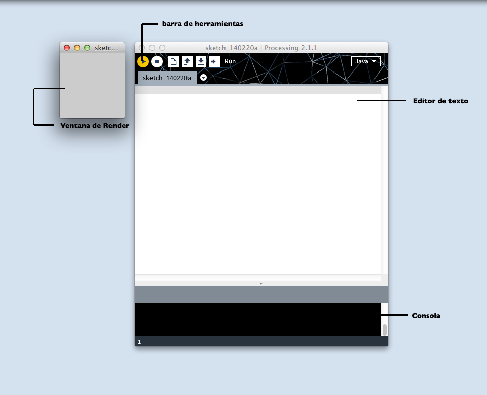
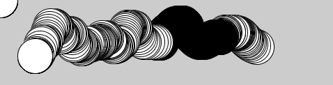
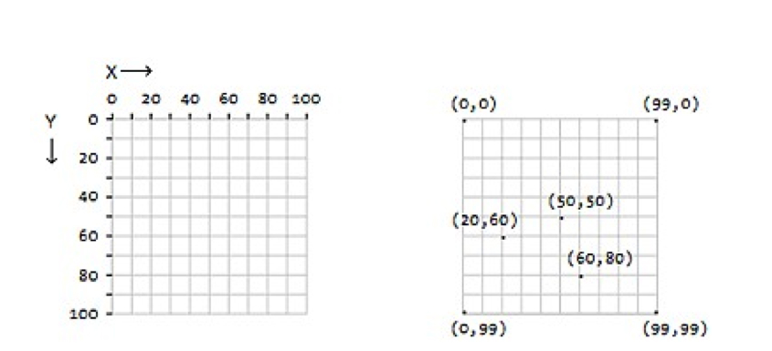

# PROCESSING – ¿ CÓMO EMPEZAR ¡ ?

__Índice__

## Capitulo 1: Hola.

    Breve introducción a los pioneros de los gráficos por computador.

    010-101110001. ¿ Que es y para que sirve la programación ?

    Que es Processing.

## Capitulo 2: Empezando con el código.

    El ambiente de desarrollo Processing o IDE

    Nuestro primer programa: Dibujando un circulo.

    Exportando/compartiendo.

    Ejemplos y referencia.

## Capitulo 3: Dibujo.

    Formas básicas.

    Orden de los dibujos.

    Propiedades de las formas.

    Color.

    Formas personalizadas.

    Comentarios.

## Capitulo 4: Variables.

    Haciendo variables.

    Las variables (constantes) de Processing

    Un poco de Matemáticas

    Repetición

## Capitulo 5: Respuesta

    Seguir

    Mapear

    Click

    Ubicación

    Tipo

## Capitulo 6: Trabajando con archivos Digitales

    Que es un archivo Digital.

    Continuo y discreto. (JPG vs SVG).

    Imágenes.

    Tipografías.

    Formas.

## Capitulo 7: Animación.

    Velocidad y dirección

    Interpolación.

    Aleatoriedad.

    Temporizadores.

    Movimientos circulares.

    Trasladar, rotar y escalar.

## Capitulo 8: Funciones.

    Funciones básicas.

    Haciendo una función.

    Valores de retorno.

## Capitulo 9: Objetos.

    Clases y objetos.

## Capitulo 10: Vectores.

    Haciendo un vector.

    Repetición y Vectores.

    Vectores y Objetos.

## Extensión.

    3D

    Exportando Imágenes.

    Comunicación con otros programas. (Arduino, Puredata)

    Comunidad.

## Apéndices.

    Tips para programar.

    Tipos de datos.

    Orden de las operaciones.


## Capitulo 1: Hola.

###  Breve introducción a los pioneros de los gráficos por computador.

La descripción técnica de computación grafica sería la actividad encargada de generar gráficos para cambiar la información visual del mundo real. Pero no es desde que la invención de programas como Pothosop, Ilustrator o Gimp que se empezaron a generar y [1]procesar imágenes por computador. Inclusive podemos remontarnos a la década de los 60’, cuando Ivan Sutherland invento el primer programa informático que permitía manipular objetos gráficos por ordenador [2]SketchPad; en palabras mas corrientes, nos permitía dibujar. Su invención es tan importante, que su trabajo ayudo a sentar las bases de lo que es una interfaz de usuario como tal.

###  010-101110001. ¿ Que es y para que sirve la programación ?

“Crear con un ordenador es el arte de comprender la naturaleza de lo digital, entender los principios que rigen el pensamiento de las máquinas. Los ordenadores ejecutan programas que están construidos a partir de un conjunto muy simple de operaciones que, combinadas, resuelven problemas complejos. Los mismos algoritmos que se utilizan para realizar cálculos matemáticos, para descifrar códigos o para hacer simulaciones físicas, pueden usarse también para crear imágenes y sonidos fascinantes. De hecho, la programación es una de las herramientas creativas más poderosas.” Del cálculo numérico a la creatividad abierta. Miguel V. Espada.

En palabras muy sencillas, describiremos que es programar en dos aspectos: El primero; programar es entender un lenguaje [3]sintáctico, que obedece a una reglas, un orden y una forma de escritura que entiende un computador. La segunda; es describirle a una computadora por medio de una serie de palabras, una acción o actividad que el programador quiera.

En nuestro caso, programar seria dibujar algo, procesar una imagen, representar un sonido por medio de figuras y colores, en resumen; programar será lo que nuestra mente se imagine y sea posible hacer por medio de una computadora.

_1 Procesar:_ Es mejorar la calidad de la imagen o facilitar la búsqueda de información en esa imagen: color, formas, objetos._

_2 SketchPad:_ http://www.youtube.com/watch?v=USyoT_Ha_bA

_3 sintáctico:_ Que obedece a unas reglas de sintaxis. Ejemplo: Los idiomas obedecen a unas reglas sintácticas.


### Que es Processing.

Processing fue desarrollado por Ben Fry y Casey Reas. Es un software para inventar imágenes, diseñar animaciones, realizar [4]visualización de datos y finalmente realizar [5]diseño de interacción. Este software esta basado en un lenguaje de programación llamado Java y es idóneo para aquellas personas que no tienen ninguna experiencia en programación y por consiguiente desean sumergirse en esta aventura desde un contexto visual.

Processing ofrece la oportunidad de aprender programación a través de la creación de gráficos interactivos. Existen muchas maneras de enseñar a escribir código, pero generalmente los estudiantes encuentran un estimulo al escuchar un sonido o ver una imagen como respuesta inmediata después de escribir líneas de código.

Processing es un proyecto OpenSource, eso quiere decir que su [6]código fuente es libre y esta al servicio de quien lo desee para mejorarlo o expandirlo. Existe una gran comunidad de colaboradores que a diario están en la internet respondiendo preguntas sobre el lenguaje.


_4 Visualización de datos:_ Es una disciplina que usa el poder de la comunicación de las imágenes para dar un significado estadístico de un proceso actual entre las masas sociales.

_5 Diseño de interacción:_ Es un campo de desarrollo interdisciplinario, donde se usan extensivamente tecnologías de origen digital y electrónico, para crear experiencias donde el usuario (persona) interactúa de forma directa o indirecta con una maquina. Ejemplo: “Delicate Boundaries -> Chris Sugrue” http://www.youtube.com/watch?v=EbmcQ2lM9J4

_6 Código fuente:_ En el desarrollo de software existe una cadena de producción. Una de las primeras es el código fuente y el código objeto. El código objeto es la aplicación como tal, Word, Excel o Paint son programas objeto, el código fuente son las líneas de código que hay detrás de la aplicación.


## Capitulo 2: Empezando con el codigo.

###  El ambiente de desarrollo Processing o IDE.

Para sacar el máximo potencial de este tutorial, necesitas mas que solo leer las palabras que están aquí escritas. Necesitas practicar, equivocarte y experimentar. No puedes aprender a programar solo leyendo, necesitas también hacerlo. Entonces para empezar, descargaremos Processing y realizaremos nuestro primer dibujo.

Empieza visitando [Processing](http://processing.org/download) y selecciona la versión que tengas en tu sistema operativo. La instalación en cada sistema operativo es muy sencilla:

1.En Linux, tendrás un archivo .tar.gz, después de descargarlo en tu [7]directorio home. Por favor abre una ventana de terminal, y escribe:

```
tar xvfz processing-xxxx.tgz
````


El comando anterior, sirve para descomprimir el archivo que acabaste de descargar.
Luego, para acceder a esa carpeta, escribiremos lo siguiente en la terminal:

```
cd processing-xxxx
````
y presionamos la tecla enter.


Si quieres ver el contenido de la carpeta, escribe el comando _ls_, que significa listar todos los elementos que tenemos en la carpeta.
Finalmente para hacer correr Processing, escribimos

```
./processing
```


con algo de suerte y un poco de paciencia, podrás ver el IDE de Processing en tu pantalla. Todos los setups son diferentes, si posees algún problema y el programa no empieza, podrás empezar de otra manera, dirigirte a los foros, donde haya podrán resolverte el problema. [foro](http://wiki.processing.org/index.php/Troubleshooting)

2.En Windows, tendrás un archivo .zip. Haz doble click, y arrastra la carpeta dentro de una ubicación en tu disco duro. Podría ser Archivos de programa o simplemente tu escritorio, pero lo importante es que la carpeta Processing sea colocada fuera de ese archivo .zip. Luego das doble click a processing.exe para empezar.

3.En Mac OSX, la versión esta en un archivo de imagen de disket (.dmg). Arrastra el icono de Processing a la carpeta Applications. Si algunas veces usas ese computador y no es posible modificar la carpeta Applications, solo arrastra la aplicación al escritorio. Entonces haga doble click en el icono de Processing para empezar. 


_7 Directorio:_ En la terminal, directorio suele nombrarseles a las carpetas de nuestro computador.

###  Nuestro primer programa: Dibujando un circulo.

__Antes de empezar:__ Todos los ejemplos de código de este tutorial, están alojados en este repositorio de git, en la carpeta llamada Getting started. 



Ahora que tenemos funcionando el entorno de desarrollo Processing. Describiremos un poco que posee, la parte blanca larga es el editor de texto y es allí donde escribiremos las líneas de código. La fila de botones en la parte superior se llama barra de herramientas y de izquierda a derecha tenemos los botones de:


1. __Play:__ ejecuta nuestro código.
2. __Stop:__ para nuestro código.
3. __New:__ abre una ventana nueva.
4. __Open:__ abre un archivo guardado en nuestro computador.
5. __Save:__ guarda nuestro programa en el computador.
6. __Export:__ exporta nuestro programa como una aplicación de escritorio.
Debajo del editor de texto tenemos la consola, que es una área de mensajes que nos mostrara detalles técnicos de nuestro código. La analizaremos mas adelante.
Por ahora empezaremos con nuestro primero programa en Processing.

### Ejemplo 1 Dibujando un Circulo.

En el editor, escribe lo siguiente:

```
ellipse(50, 50, 80, 80);
```


Esta línea de código es un método para “dibujar un circulo”, felicidades, haz realizado tu primer programa en Processing ¡.

No entraremos en detalles sobre esta línea de código, simplemente estamos iniciando con una pequeña muestra sobre lo que podemos hacer con Processing, mas adelante entraremos en detalles.

Si tienes escrita la línea correctamente, podrás ver una imagen de un circulo. Si tu escritura es errónea, se mostrará en la consola un mensaje de color rojo, indicando algunas veces el error. Si esto sucede, es mejor que copies el código del ejemplo exactamente. Los números deberían estar dentro del paréntesis y tener comas después de cada uno de ellos, la línea debería finalizar cerrando un paréntesis y con punto y coma.  

Una de las cosas complicadas para empezar con la programación, es que siempre tienes que estar especificando la sintaxis de la línea. El software Processing no es siempre lo suficientemente inteligente para saber que quieres decir, y puede ser bastante exigente sobre la colocación de la puntuación. Puedes acostumbrarte con la practica.

Después, seguiremos adelante con nuestro [8]sketch que se pondrá mas interesante.

### Ejemplo 2 Dibujando círculos

Borra la línea de código anterior, y ahora prueba este código:



```
void setup()
{
  size(480, 120);
  smooth();
}

void draw()
{
  if (mousePressed)
  {
    fill(0);
  } 
  else
  {
    fill(255);
  }
  
  ellipse(mouseX, mouseY, 80, 80);
}
```
Hablemos un poco sobre este programa: este programa crea un ventana de 480 pixeles de ancho y 120 pixeles de alto; y dibuja círculos en la posición del mouse. Cuando el botón del mouse es presionado, el color de circulo cambia a negro, y cuando se suelta vuelve a su color original.
Explicaremos mas adelante los detalles de este código, por ahora; corre el código, mueve el mouse y diviértete ☺.

### Atajos.

Si no queremos usar los botones, siempre puedes usar los atajos del teclado. Para correr el sketch puedes teclear Ctrl-R (en Windows y linux) o Cmd-R en Mac.
Puedes usar también la opción Present, que mostrara tu sketch en pantalla completa, ideal para presentaciones o instalaciones. La puedes encontrar en el menú sketch en Processing.
Para guardar tu proyecto puedes usar el icono anteriormente mencionado o usar Ctrl-S (Windows y linux) o Cmd-S (Mac). Por defecto, todos tus sketch estarán guardados en “sketchbook”. Que es una carpeta que guarda tus programas para un fácil acceso. Normalmente esta alojada en el directorio documentos en tu computadora.
Clicando sobre el botón abrir en la barra de herramientas (la flecha apuntando hacia arriba) podremos abrir una lista de todos tus programas (sketches) en tu carpeta sketchbook, también hay una lista con ejemplos instalados en el software Processing.
A menudo es bueno obtener correctas rutinas de programación, y una de ellas es guardar nuestro trabajo, pues Processing no dispone de una función de auto-guardado. Cuando se trata de diferentes procesos bajo una misma idea, guardarlos con diferentes nombres es ideal para tener diferentes versiones, además de volver a nuestra versión anterior. También puedes observar donde está ubicado el sketch en tu disco con la opción show bajo el sketch menú. 
Si presionas el botón new, reemplazaremos el sketch presente en la ventana, con un sketch limpio. Ctrl-N (Linux y Windows) o Cmd-N (Mac) para crear un nuevo sketch, o File -> New para crear igualmente la ventana.

__8 sketch:__ Suele llamárseles a los programas realizados en processing. 

### Exportando/compartiendo.

Otro tema importante de Processing es compartir tu trabajo. El botón de exportar en la barra de herramientas. (flecha apuntando hacia la derecha).
Este botón lo que hace es que agrupa todo tu código en una sola carpeta llamada applet, que se puede descargar desde un servidor web. Después de exportar, la carpeta applet puede abrirse en el escritorio. 

### Ejemplos y referencia

Aprender a programar con Processing implica explorar muchos códigos: correrlos, alterarlos, romperlos, y repasarlos hasta tener algo nuevo en base a la experimentación. Con esto en mente, en la descarga del software Processing se incluyen decenas de ejemplos de demostración, con diferentes características del software. Para abrir los ejemplos, selecciona ejemplos desde el menú File o clickea el icono en la barra de herramientas. Los ejemplos están agrupados por categorías según su función, forma y funcionamiento.
Si ves una parte del programa con la cual no estás familiarizado y es de color naranja (esto es un [9]método de una parte del Processing), selecciona esa palabra, click derecho (en Windows o ctrl-click en Mac) y selecciona “find in Reference” y entraras al menu de ayuda. Abrirás la referencia en un navegador web para el elemento del código seleccionado. La referencia también está disponible online en [referencia](http://www.processing.org/reference/.)

La referencia de Processing explica cada elemento de código con una descripción y algunos ejemplos. La referencia usualmente son programas muy cortos (usualmente cuatro o cinco líneas) y son más fáciles de entender que los códigos largos en la carpeta de ejemplos. Recomendamos abrir la referencia cuando estés leyendo este libro y cuando estés programando. 

__9 metodo:__  Suele llamarsele metodo a una porción de codigo que esta dentro de una clase y que tiene alguna funcionalidad.


## Capitulo 3: Dibujo.

### Formas básicas.

Lo primero que hay que saber, es que dibujar sobre una pantalla de computador es como trabajar en una hoja cuadriculada. Primero empezamos paso por paso, teniendo un proceso técnico cuidadoso. Empezaremos dibujando formas simples que luego se expandirán a la animación y la interacción. Pero empecemos por el principio.
Una pantalla de computador es una red de luces con elementos llamados pixeles. Cada pixel tiene una posición en la pantalla definida por coordenadas. El eje de coordenadas x es la distancia horizontal desde el origen y el eje de coordenadas y es la distancia vertical. En Processing, el origen es la esquina superior izquierda de la ventana de representación y coordina los valores hacia abajo y hacia la derecha. La imagen de la izquierda muestra el sistema de coordenadas, y la imagen de la derecha muestra varias posiciones en la rejilla:



Como muestra el ejemplo anterior, si queremos dibujar un pixel en la pantalla; lo llevaremos a cabo de la siguiente manera: Si la pantalla es de 100 por 100 pixeles (Grafica anterior izquierda) entonces podemos decir que la coordenada superior izquierda es de (0, 0) ⇔ (x, y). El centro esta en (50, 50) ⇔(x, y). Y la izquierda de abajo es (99, 99) ⇔ (x, y). Pero esto parece algo confuso, ¿ Porque si el tamaño es de 0 a 100 vamos a recorrerlo de 0 a 99 ?, la respuesta es sencilla, en computación, el cero también es un numero, entonces; si tenemos una cantidad de 1 a 10, realmente tenemos de 0 a 9.

La pantalla es creada y las imágenes son dibujadas adentro de esta a través de elementos del código llamados funciones. Las funciones son los ladrillos básicos de un programa de Processing. El comportamiento de una función es definida por sus parámetros, por ejemplo; al menos cada programa de Processing tiene una función de _size()_ para establecer el ancho y el alto de la pantalla de dibujo. (Si el programa no tiene una función de _size()_, Processing establece una determinada de 100 x 100 pixeles).

### Ejemplo 1. Dibujar una ventana.

La función _size()_ tiene dos parámetros: el primero establece el ancho de la ventana y el segundo establece el alto de la ventana. Para dibujar una ventana que sea de 800 pixeles de ancho y 600 pixeles de alto, se escribe:

```
Size(800, 600);
```

Corra este línea de código para ver el resultado. Experimente a escribir diferentes números para ver que resulta. Intente con números muy pequeños y números mas grandes que los de su ventana.

### Ejemplo 2. Dibujar un punto.

Para establecer el color de un solo pixel en la ventana, usamos la función _point()_. Esta tiene dos parámetros que definen su posición: la coordenada x seguida de la coordenada y. Para dibujar una pequeña ventana y un punto en el centro de la pantalla, debería escribir _size()_ seguida de la función _point()._

```
size(200, 200);
point(100, 100);
```


### Formas básicas.

Processing incluye un grupo de funciones para dibujar formas básicas. Las formas simples como las líneas pueden ser combinadas para crear formas más complejas como una hoja o una cara. Para dibujar una sola línea, necesitamos cuatro parámetros: dos para fijar las coordenadas x y y iniciales y otras dos coordenadas x y Y  para las posiciones finales.


### Ejemplo 2: Dibujar una línea.

Para dibujar una línea entre las coordenadas (20, 50) y (420, 110), intenta:


```
size(480, 120);
line(20, 50, 420, 110);
```

### Ejemplo 3: Dibujando formas básicas.

Siguiendo este patrón, un triángulo necesita seis parámetros y un cuadrilátero necesita 8 (un par por cada punto):


```
size(480, 120);
quad(158,55,199,14,392,66,351,107);
triangle(347,54,392,9,392,66);
triangle(158,55,290,91,290,112);
```

### Ejemplo 4: dibujando un rectángulo

Los rectángulos y círculos son definidos con cuatro parámetros: el primero y el segundo son para las coordenadas X y Y del punto de anclaje, el tercero y cuarto para el ancho y alto. Para hacer un rectángulo con las coordenadas (180,60) con un ancho de 220 pixeles y un largo de 40, usa la función _rect()_ así:


```
size(480, 120);
rect(180, 60, 220, 40);
```

### Ejemplo 5: dibujar un circulo.

Las coordenadas x y Y de un rectángulo son las de la esquina superior izquierda, pero en un circulo son las del centro de la forma. En este ejemplo, notamos que la coordenada Y para el primer circulo esta fuera de la ventana. Los objetos pueden ser dibujados parcialmente (o enteramente) fuera de la ventana sin ningún error.


```
size (480,120);
ellipse (278,-100,400,400);
ellipse (120,100,110,110);
ellipse (412,60,18,18);
```

### Ejemplo 6: dibujar parte de un circulo (arcos).

La función arc() dibuja parte de un circulo.


```
size (480,120);
arc (90,60,80,80,0, HALF_PI);
arc (190,60,80,80,0, PI+HALF_PI);
arc (290,60,80,80, PI, TWO_PI+HALF_PI);
arc (390,60,80,80, QUARTER_PI, PI+QUARTER_PI);
```

En esta función, el primer y segundo parámetro establecen la ubicación, el tercero y cuarto establecen el ancho y el largo. El quinto parámetro establece el ángulo para empezar el arco, y finalmente, el sexto fija donde para el ángulo. Los ángulos están establecidos en [10]radianes, en lugar de grados. Los radianes son ángulos de medición basados en el valor de pi (3.14159). En el siguiente grafico se muestra como ambos se relacionan. Tal como se presenta en este ejemplo, cuatro valores de radian son reemplazados por nombres especiales, para estos fue agregada una parte de Processing. Los valores PI, QUARTER_PI, HALF_PI, y TWO_PI pueden ser usados para reemplazar el valor de 180, 45, 90, 360, radianes.


### EJERCICIOS !!!

Intenta escribir un programa que dibuje 4 líneas y que toque cada esquina de tu pantalla. Intenta dibujar líneas verticales, horizontales y diagonales. Mira un ejemplo aquí:


Solucion.

```
size(500, 500);
line(0, 0, 500, 500);
line(500, 0, 0, 500);
line(0, 250, 500, 250);
line(250, 0, 250, 500);
```
__10 radianes:__ Representa el ángulo central en una circunferencia y abarca un arco cuya longitud es igual a la del radio. 

## Orden de los dibujos.


