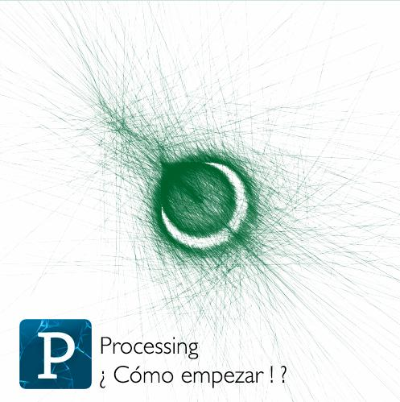
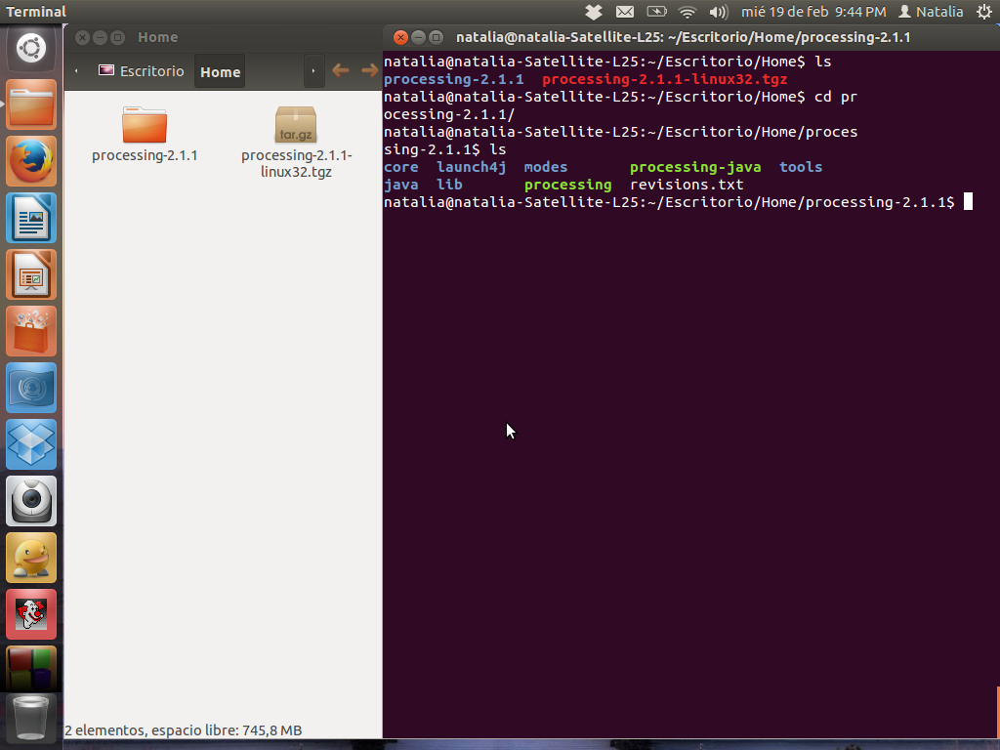

# PROCESSING – ¿ CÓMO EMPEZAR ¡ ?

Índice

Capitulo 1: Hola.

    Breve introducción a los pioneros de los gráficos por computador.

    010-101110001. ¿ Que es y para que sirve la programación ?

    Que es Processing.

Capitulo 2: Empezando con el código.

    El ambiente de desarrollo Processing o IDE

    Nuestro primer programa: Dibujando un circulo.

    Exportando/compartiendo.

    Ejemplos y referencia.

Capitulo 3: Dibujo.

    Formas básicas.

    Orden de los dibujos.

    Propiedades de las formas.

    Color.

    Formas personalizadas.

    Comentarios.

Capitulo 4: Variables.

    Haciendo variables.

    Las variables (constantes) de Processing

    Un poco de Matemáticas

    Repetición

Capitulo 5: Respuesta

    Seguir

    Mapear

    Click

    Ubicación

    Tipo

Capitulo 6: Trabajando con archivos Digitales

    Que es un archivo Digital.

    Continuo y discreto. (JPG vs SVG).

    Imágenes.

    Tipografías.

    Formas.

Capitulo 7: Animación.

    Velocidad y dirección

    Interpolación.

    Aleatoriedad.

    Temporizadores.

    Movimientos circulares.

    Trasladar, rotar y escalar.

Capitulo 8: Funciones.

    Funciones básicas.

    Haciendo una función.

    Valores de retorno.

Capitulo 9: Objetos.

    Clases y objetos.

Capitulo 10: Vectores.

    Haciendo un vector.

    Repetición y Vectores.

    Vectores y Objetos.

Extensión.

    3D

    Exportando Imágenes.

    Comunicación con otros programas. (Arduino, Puredata)

    Comunidad.

Apéndices.

    Tips para programar.

    Tipos de datos.

    Orden de las operaciones.


## Capitulo 1: Hola.

###  Breve introducción a los pioneros de los gráficos por computador.

La descripción técnica de computación grafica sería la actividad encargada de generar gráficos para cambiar la información visual del mundo real. Pero no es desde que la invención de programas como Pothosop, Ilustrator o Gimp que se empezaron a generar y [1]procesar imágenes por computador. Inclusive podemos remontarnos a la década de los 60’, cuando Ivan Sutherland invento el primer programa informático que permitía manipular objetos gráficos por ordenador [2]SketchPad; en palabras mas corrientes, nos permitía dibujar. Su invención es tan importante, que su trabajo ayudo a sentar las bases de lo que es una interfaz de usuario como tal.

###  010-101110001. ¿ Que es y para que sirve la programación ?

“Crear con un ordenador es el arte de comprender la naturaleza de lo digital, entender los principios que rigen el pensamiento de las máquinas. Los ordenadores ejecutan programas que están construidos a partir de un conjunto muy simple de operaciones que, combinadas, resuelven problemas complejos. Los mismos algoritmos que se utilizan para realizar cálculos matemáticos, para descifrar códigos o para hacer simulaciones físicas, pueden usarse también para crear imágenes y sonidos fascinantes. De hecho, la programación es una de las herramientas creativas más poderosas.” Del cálculo numérico a la creatividad abierta. Miguel V. Espada.

En palabras muy sencillas, describiremos que es programar en dos aspectos: El primero; programar es entender un lenguaje [3]sintáctico, que obedece a una reglas, un orden y una forma de escritura que entiende un computador. La segunda; es describirle a una computadora por medio de una serie de palabras, una acción o actividad que el programador quiera.

En nuestro caso, programar seria dibujar algo, procesar una imagen, representar un sonido por medio de figuras y colores, en resumen; programar será lo que nuestra mente se imagine y sea posible hacer por medio de una computadora.

_1 Procesar:_ Es mejorar la calidad de la imagen o facilitar la búsqueda de información en esa imagen: color, formas, objetos._

_2 SketchPad:_ http://www.youtube.com/watch?v=USyoT_Ha_bA

_3 sintáctico:_ Que obedece a unas reglas de sintaxis. Ejemplo: Los idiomas obedecen a unas reglas sintácticas.


### Que es Processing.

Processing fue desarrollado por Ben Fry y Casey Reas. Es un software para inventar imágenes, diseñar animaciones, realizar [4]visualización de datos y finalmente realizar [5]diseño de interacción. Este software esta basado en un lenguaje de programación llamado Java y es idóneo para aquellas personas que no tienen ninguna experiencia en programación y por consiguiente desean sumergirse en esta aventura desde un contexto visual.

Processing ofrece la oportunidad de aprender programación a través de la creación de gráficos interactivos. Existen muchas maneras de enseñar a escribir código, pero generalmente los estudiantes encuentran un estimulo al escuchar un sonido o ver una imagen como respuesta inmediata después de escribir líneas de código.

Processing es un proyecto OpenSource, eso quiere decir que su [6]código fuente es libre y esta al servicio de quien lo desee para mejorarlo o expandirlo. Existe una gran comunidad de colaboradores que a diario están en la internet respondiendo preguntas sobre el lenguaje.


_4 Visualización de datos:_ Es una disciplina que usa el poder de la comunicación de las imágenes para dar un significado estadístico de un proceso actual entre las masas sociales.

_5 Diseño de interacción:_ Es un campo de desarrollo interdisciplinario, donde se usan extensivamente tecnologías de origen digital y electrónico, para crear experiencias donde el usuario (persona) interactúa de forma directa o indirecta con una maquina. Ejemplo: “Delicate Boundaries -> Chris Sugrue” http://www.youtube.com/watch?v=EbmcQ2lM9J4

_6 Código fuente:_ En el desarrollo de software existe una cadena de producción. Una de las primeras es el código fuente y el código objeto. El código objeto es la aplicación como tal, Word, Excel o Paint son programas objeto, el código fuente son las líneas de código que hay detrás de la aplicación.


## Capitulo 2: Empezando con el codigo.

###  El ambiente de desarrollo Processing o IDE.

Para sacar el máximo potencial de este tutorial, necesitas mas que solo leer las palabras que están aquí escritas. Necesitas practicar, equivocarte y experimentar. No puedes aprender a programar solo leyendo, necesitas también hacerlo. Entonces para empezar, descargaremos Processing y realizaremos nuestro primer dibujo.

Empieza visitando [Processing](http://processing.org/download) y selecciona la versión que tengas en tu sistema operativo. La instalación en cada sistema operativo es muy sencilla:

1.En Linux, tendrás un archivo .tar.gz, después de descargarlo en tu [7]directorio home. Por favor abre una ventana de terminal, y escribe:

```
tar xvfz processing-xxxx.tgz
````


El comando anterior, sirve para descomprimir el archivo que acabaste de descargar.
Luego, para acceder a esa carpeta, escribiremos lo siguiente en la terminal:

```
cd processing-xxxx
````
y presionamos la tecla enter.



Si quieres ver el contenido de la carpeta, escribe el comando _ls_, que significa listar todos los elementos que tenemos en la carpeta.
Finalmente para hacer correr Processing, escribimos

```
./processing
```


con algo de suerte y un poco de paciencia, podrás ver el IDE de Processing en tu pantalla. Todos los setups son diferentes, si posees algún problema y el programa no empieza, podrás empezar de otra manera, dirigirte a los foros, donde haya podrán resolverte el problema. [foro](http://wiki.processing.org/index.php/Troubleshooting)

2.En Windows, tendrás un archivo .zip. Haz doble click, y arrastra la carpeta dentro de una ubicación en tu disco duro. Podría ser Archivos de programa o simplemente tu escritorio, pero lo importante es que la carpeta Processing sea colocada fuera de ese archivo .zip. Luego das doble click a processing.exe para empezar.

3.En Mac OSX, la versión esta en un archivo de imagen de disket (.dmg). Arrastra el icono de Processing a la carpeta Applications. Si algunas veces usas ese computador y no es posible modificar la carpeta Applications, solo arrastra la aplicación al escritorio. Entonces haga doble click en el icono de Processing para empezar. 


_7 Directorio:_ En la terminal, directorio suele nombrarseles a las carpetas de nuestro computador.


