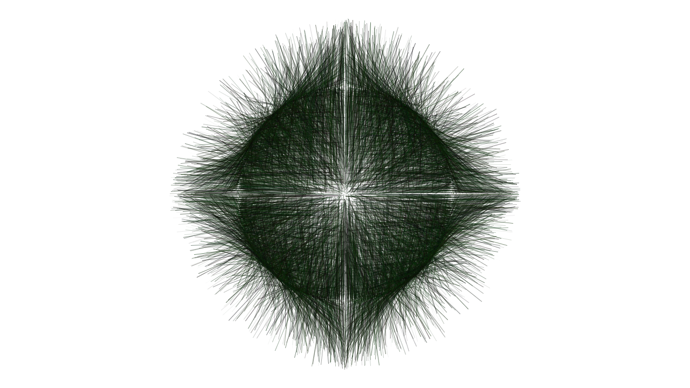

### DIVULGACIÓN.

__Processing__ es un programa que permite hacer imágenes interactivas, visualización de datos y gráficos generativos en tiempo real. 

## Introducción. 

Las imágenes en cuadros, historietas o las fotos de las revistas, representan momentos estáticos o memorias de quien realiza la imagen. __Processing__ es un software que permite transformar imágenes quietas en gráficos interactivos, ya que estos pueden reaccionar a diversos factores externos, como por ejemplo al pulsar una tecla del computador, mover el mouse o detectar un sonido.__Delicate BounDaries__ de __Chris Sugrue__ [link](https://vimeo.com/1007230), es una instalación interactiva donde se proyecta en una pantalla un ecosistema donde viven bichos, cuando la persona toca esa pantalla, los bichos salen de su hábitat para incorporarse en el cuerpo del usuario.


__Processing__ también permite que los computadores puedan crear imágenes por medio de formulas matemáticas,  este proceso puede generar imágenes que son alusivas a la naturaleza como por ejemplo arboles, plantas y flores. __György Kepes__ es un artista que usa los procesos del arte generativo para crear imágenes que evolucionan en tiempo real. [link](http://butdoesitfloat.com/The-line-that-describes-the-beautiful-is-elliptical-It-has-simplicity)


Otro aspecto importante de  __Processing__ es su capacidad para procesar y visualizar datos en tiempo real. Entendemos los  datos como cualquier información que se puede representar numéricamente y que esta en constante cambio. Las unidades de medida, el clima o los votos en tiempo de elecciones son ejemplos de datos. En la música, las notas también se pueden representar como datos por medio del protocolo MIDI, normalmente usado para comunicar diversos aparatos musicales entre sí. En el campo visual, los datos MIDI también tienen un uso creativo como herramienta de visualización para conciertos en vivo, reemplazando las luces, por sistemas inteligentes que se sincronizan  con la música en tiempo real.
Tenemos como referente a __Etienne de Crécy__ y __1024__ los cuales se destacan en el ámbito de las sincronización de imagen en tiempo real. [link](https://www.youtube.com/watch?v=vXE2x3y51Fk)


## Descripción y practicas.

Cuando dibujamos cualquier figura en una hoja de papel, podemos hacer pequeños trazos que siempre terminan en figuras, que el diseño gráfico llama bocetos. Pero cuando tomamos esa imagen, y la capturamos en una fotografía, tenemos una representación digital de ese boceto. 

__Processing__ es un programa de computadora que permite hacer bocetos digitales interactivos,  escribiendo oraciones (programando) de manera escrita. Pero antes de que el computador pueda saber que queremos hacer, nosotros necesitamos aprender un lenguaje que el programa pueda entender, en pocas palabras,  necesitamos comunicarnos con la maquina. De este modo,  cuando queremos comunicarnos con un extranjero, debemos hablar en su idioma para poder entablar una conversación, el software __Processing__ entiende un lenguaje destilado de Java, que es un lenguaje para escribir software de computadoras.

Ahora, ¿ Cómo hace el computador para entender todo ese texto que escribimos si el no sabe nuestro idioma ?. Antes de responder esa pregunta, tenemos que enterarnos  que una computadora es solamente una maquina como cualquier otra, que sin una orden, es incapaz de realizar cualquier acción.  De esta forma se establece una comunicación usuario/maquina y se fijan ordenes mas especificas al computador.

__Processing__ se destaca porque tiene una sintaxis (esas oraciones) fácil de aprender, ya que con solo una oración (línea de código) podemos ver un circulo en la pantalla;  si escribimos unas cuantas líneas  de código más,  ese circulo puede seguir la posición del ratón. 

Adentrémonos un poco en lo que para mi es el fascinante mundo de la programación. Imagínese describiendo todos los pasos necesarios para enseñarle a un robot a vestirse. Muchas personas resolverían el problema con decirle al robot:

1.	busca la ropa.
2.	busca una camisa y un pantalón.
3.	ponte la camisa.
4.	ponte el pantalón.

Pero al intentar ejecutar la orden número uno, el robot puede perderse porque no sabe donde esta la ropa, entonces quizá debemos ser más específicos.
Otra solución mas detallada seria:

1.	dirígete al closet.
2.	Abre el closet.
3.	Mira hacia la derecha
4.	Levanta la mano derecha
5.	Elige una camisa y tómala.
6.	Mira hacia la izquierda.
7.	Toma un pantalón.
8.	Deja las prendas tiradas en el suelo.
9.	Cierra el closet
10.	Recoge las prendas.
11.	Ponte la camisa
12.	Ponte el pantalón.

Hay ocasiones en que, incluso, debemos ser mas explícitos y  descriptivos. Programar una computadora es, sencillamente, describir los pasos necesarios para resolver un problema. Por consiguiente, para dibujar imágenes y realizar animaciones,  podríamos usar pasos similares a los que se suelen realizar al hacer, por ejemplo, cálculos complejos y análisis estadísticos. 

Este es el punto fuerte de __Processing__, ya que al tratarse de un lenguaje de programación, todos nuestros dibujos pueden ser interactivos: esto quiere decir que esos gráficos en pantalla pueden reaccionar al teclado, al presionar el ratón y con ayuda de cámaras; podemos hacer seguimiento de colores o reconocimiento de rostros. Esa es la gran diferencia de dibujar con un papel y usar una computadora. __Processing__ puede hacer que simples esbozos se conviertan en “dibujos inteligentes”, ya que esos gráficos pueden tomar decisiones o quizás puedan reaccionar a algo si así lo queremos. En definitiva, cuando estamos dibujando por medio de código podemos hacer la semejanza de que estamos creando un universo por medio de un lenguaje escrito.

Para empezar con __Processing__ debemos dirigirnos a su portal [web]( https://processing.org/download/), y descargarlo porque es libre como el aire; nos preguntaran si queremos hacer un tipo de donación para financiar el proyecto, luego lo instalamos en nuestra computadora y estamos listo para iniciar.

La interfaz de __Processing__ esta compuesta por una serie de botones en la parte superior los cuales pueden ser intuitivos, un botón de start, otro de stop y otros que explicaremos mas adelante. 


Debajo, podemos mirar una gran zona blanca; llamada también editor de texto. Esta es la zona mas importante, ya que aquí será donde escribiremos nuestras oraciones o líneas de código.  


Empecemos por escribir esto:

```
size(250, 250);                     // Tamaño de nuestra hoja de dibujo
background(0);                      // Color de la hoja
fill(255, 0, 0);                    // Color del circulo
ellipse(width/2, height/2, 60, 60); // pintamos un circulo en la pantalla
```

Después de escribir o copiar este pequeño código en __Processing__, presionamos start para que el programa traduzca esas oraciones en una imagen. Podemos ver un circulo en la mitad de la pantalla, un fondo negro y el circulo pintado de rojo.

Expliquemos mas detalladamente el programa anterior.

Empezamos por decir “size( 250, 250 );”size es una función que se usa para inicializar el tamaño de nuestra hoja de dibujo, en este caso tenemos una hoja de 250 pixeles de ancho por 250 pixeles de alto. Seguidamente, tenemos “background( 0 );”, esta función se usa para dar un color de fondo a nuestra pantalla, que en este caso es negro. Después tenemos otra función que dicta “fill( 255, 0, 0);” la cual se usa para pintar el relleno de las figuras, que en este caso se usa para pintar un circulo de color rojo. Y finalmente dibujamos nuestro circulo, tenemos “ellipse( width/2, height/2, 60, 60);” con esa oración el programa entiende: dibújame un circulo en la posición del eje X en el centro de la pantalla y en la posición Y den el dentro de la pantalla, además; quiero que ese circulo tenga 60 pixeles de ancho y 60 pixeles de alto.

Lo invito a que proceda a cambiar el código, añadiendo otros números en fill(); o background(); . Experimentar es una muy buena forma de saber como funcionan las cosas.
Una introducción mas exhaustiva se puede obtener de este link. [como empezar]( http://hello.processing.org/)

Ahora, para finalizar esta parte de entrada con nuestro ejercicio de introducción: realizaremos un pequeño y simple programa para que el circulo siga la posición de cursor.

```
//  método de inicialización
void setup()
{
  size(250, 250);  //  Tamaño de la hoja de dibujo
  background(0);   //  Color de fondo de la hoja de dibujo
}

//  método donde se repite el código dentro, hasta que se presione el botón stop o se cierre la ventana 
void draw()
{
  fill(255, 0, 0);                  //  color del circulo
  ellipse(mouseX, mouseY, 60, 60);  //  pintamos un circulo
  //  mouseX y mouseY se usan para obtener las coordenadas de la posición del cursor
}
```


Ahora podemos dotar un programa de __Processing__ de algún tipo de inteligencia para que el pueda dibujar por si solo, nosotros solo nos preocuparemos de darle al programa las herramientas y parámetros de cómo dibujar.

Empezamos por decir que las cosas construidas por el hombre siempre son edificaciones no muy complejas, lo mas importante es que sean solidas y resistentes con el pasar del tiempo, esto en detalles técnicos. Pero un punto importante y un tanto espiritual es que las construcciones del hombre siempre se fijan de afuera hacia adentro. En una casa,  por ejemplo, se empieza por fijar las bases, luego las columnas, después los muros y así sucesivamente, siguiendo rigurosamente unos estándares para que esta edificación no decaiga.

Particularmente, la evolución humana y de la naturaleza no funciona de este modo. Se trata de un proceso de errores de millones de años, donde no se crea y se construye como hace el hombre, sino que se evoluciona y se complejizan esos métodos de nacimiento. Hablo entonces aquí de adentro hacia fuera, y es de este modo como funciona la naturaleza.

En el mundo del arte, los programas que toman una decisión sobre como evolucionar siguiendo unos parámetros son llamados generativos. Pero estos parámetros son decididos por el programa realizado en __Processing__ al azar, no son impuestos como cuando queremos que se dibuje un circulo con tal color en tal posición.

Empecemos por preguntarnos entonces, ¿ Que es lo que hace la función ellipse de __Processing__ ? la respuesta es simple, “pues dibujar un circulo”, eso es verdad, pero si desintegramos ese método que trae por defecto el programa, nos daremos cuenta que esconde unos métodos matemáticos para realizar el dibujo del circulo.

Miremos el siguiente código:

```
// creación de circulo con funciones trigonométricas

//radio del circulo
float radius = 45;  

//Angulo de inicio
int angle = 180;

//Coordenadas centrales del circulo
int centerx = 250;
int centery = 150;

void setup()
 {
  size(500, 300);   //  Tamaño de la hoja de dibujo
  background(255);  //  Color de fondo de la hoja de dibujo
  strokeWeight(5);  //  Grosor de la línea de dibujo del circulo

  //creacion del circulo con la función de Processing
  stroke(0, 30);                                  //  color de la línea de dibujo
  noFill();                                       //  quitamos el relleno del circulo
  ellipse(centerx, centery, radius*2, radius*2);  //  pintamos un circulo
}

void draw()
 {

  angle ++;  // incrementamos el circulo sumándole 1 infinitamente
  float rad = radians(angle); 
  
  /*  Creamos una variable llamada rad, la cual se incrementara toma el incremento
      de angle y lo convierte en radianes.
  */

  /*  Creamos una variable llamada x, y le asignamos el valor almacenado en centerx, a 
      este le sumamos el valor almacenado en radius y lo multiplicamos por el 
      coseno de la variable rad
  */
  
  float x = centerx + (radius * cos(rad));  

  /*  Creamos una variable llamada y, y le asignamos el valor almacenado en centery,
      a este le sumamos el valor almacenado en radius y lo multiplicamos por el seno
      de la variable rad
  /*

  float y = centery + (radius * sin(rad)); 
  stroke(20, 50, 70);

  //  Dibujamos un punto y este a su vez dibujara un circulo
  point(x, y);
}
```

En el anterior código hicimos un uso de funciones trigonométricas como “sin()” y “cos()”, las cuales son métodos matemáticos para dibujar funciones periódicas.
De esta manera, nos entrañamos en la función ellipse() y realizamos nuestro propio método de dibujado de un circulo.

Ahora tomando este punto de partida, y añadiendo algo de “random();”, podemos decirle al programa que cree una figura dentro de un estándar que es el método de dibujar un circulo que discernimos anteriormente.
```

float radius = 100; //  radio de nuestra forma
int centX = 250;    //  centro en el eje X
int centY = 150;    //  centro en el eje Y

void setup () 
{ 
  size(500, 300); 
  background(255); 
  strokeWeight(5); 
  smooth();  //  esta función ayuda a alisar las formas, para que se visualmente se vean mas definidas

  stroke(0, 30);
  noFill(); 
  ellipse(centX, centY, radius*2, radius*2);
  stroke(20, 50, 70);
  strokeWeight(1);

  float x, y;
  float noiseval = random(10);  //  creamos una variable que generara valores aleatorios entre 0 y 10

  //  valores de random en el start point
  float radVariance, thisRadius, rad;
 
  //  empezamos a crear nuestra forma
  beginShape();
  fill(20, 50, 70, 50); //  color de relleno de nuestra forma

  // realizamos un loop desde 0 hasta 360 grados en incrementos de 1
  for (float ang=0;ang<=360;ang+=1) 
{
    // valores de random en el start point
    noiseval += 0.1; //  incrementamos la variable noiseval en valores de 0.1

    /* a la variable radVariance le asignamos la función customNoise con el parámetro noiseval,
       el cual se esta incrementado y lo multiplicamos por 30.
    */
    
    radVariance = 30 * customNoise(noiseval);

    /*  con esta variable, el dibujo en Processing no dibujo un circulo perfecto, sino que 
        realiza pequeños cambios para realizar pétalos.
    */
   
    thisRadius = radius + radVariance; 
    rad = radians(ang);
    x = centX + (thisRadius * cos(rad)); 
    y = centY + (thisRadius * sin(rad));
    curveVertex(x, y);
  }
  endShape();
}

//  función personalizada para realizar el cambio de periodicidad del punto de dibujo
float customNoise(float value) 
{ 
  float retValue = pow(sin(value), 3); 
  return retValue;
}
```

Siempre que ejecutamos el código, por decirlo de alguna manera; los pétalos no nacen en el mismo lugar, siempre giran en sentido horario de las agujas del reloj, permitiendo que siempre sea diferente de la anterior.

Por ultimo observaremos otro ejemplo para observar la evolución de una imagen en __Processing__, a esta imagen le añadiremos algo aprendido en ejercicios anteriores, pues la figura se generar siempre y cuando presionemos cualquier tecla de nuestra computadora, lo cual añadirá a nuestra imagen una forma de interactividad muy simple:

```
//  Johnny Sepúlveda
//  2013

//  Variables globales
float radius = 100; 
int centX = 250; 
int centY = 250;
float lastx_1 = -999;
float lasty_1 = -999;
float lastx_2 = 999;
float lasty_2 = 999;
float x1, y1, x2, y2;
float radio_noise = random(10);
float angulo;

void setup()
{
  size(500, 500); 
  background(255); 
  strokeWeight(5); 
  smooth();
  frameRate(29);
  //stroke(0, 30);
  //noFill(); 
  //ellipse(centX, centY, radius*2, radius*2);
}

void draw()
{
  angulo++; 
  radio_noise += 0.05;

  if ( angulo > 360) angulo = -360;

  //  Debemos presionar alguna tecla de nuestro computador para que la figura pueda evolucionar
  if (keyPressed == true)
  {
    float rad_1 = radians(angulo);
    float rad_2 = rad_1 + PI ;
    float mi_radio_1 = noise((radio_noise) * rad_2) * random(width-500); 
    float mi_radio_2 = noise((radio_noise) * rad_2) * random(height-500); 
    x1 = centX +(mi_radio_1  +  miRuido_1(random(100))  * cos( rad_1) ) ;
    y1 = centY +(mi_radio_2  +  miRuido_2(random(100))  * sin( rad_1) );
    x2 = centX + (noise(mi_radio_1)*random(250)  * cos(rad_2));
    y2 = centY + (noise(mi_radio_2)*random(250)  * sin(rad_2));
  }

  if ((lastx_1 > -999) && (lastx_2 < 999))
  {
    strokeWeight(0.5);
    stroke(random(20), random(50), random(15), random(150));
    fill (255, 0, 0, 20);
    line(x1, y1, x2, y2);
  }

  //  Con estas asignaciones, estamos diciéndole al programa que el punto actual es igual al punto anterior.
  lastx_1 = x1;
  lasty_1 = y1;
  lastx_2 = x2;
  lasty_2 = y2;
}

//  funciones personalizadas que retornan un valor flotante.
float miRuido_1(float value)
{
  value = random(10);
  float counter = int( value % width);
  float retValue = pow(sin(value), counter);
  float rev = retValue + noise(value)-100;
  return rev;
}

float miRuido_2(float value)
{
  value = random(10);
  float counter = int( value % height);
  float retValue = pow(cos(value), counter);
  float rev = retValue + noise(value)-100;
  return rev;
}
```
Nuestra la figura podría evolucionar en esta forma:



Finalmente, nuestra ultima practica será tomar los datos generados por un controlador MIDI, y realizar una visualización de estos datos. Por ejemplo, si presionamos DO entonces __Processing__ debe dibujar un circulo, si presionamos RE entonces __Processing__ debe dibujar un triangulo y así sucesivamente.

Debemos empezar por descargar una librería en Processing. Una librería es un paquete de código que tiene alguna funcionalidad y extiende las funcionalidades de __Processing__ . Con ayuda de librerías, podemos conectar la kinect a __Processing__ para que nuestros dibujos sean reactivos a nuestros movimientos. Puedes echar un vistazo a todas las librerías que tiene __Processing__ en este [link]( http://processing.org/reference/libraries/)

Iniciemos. Necesitamos una librería que nos permita reconocer un controlador MIDI en __Processing__, yo conozco tres; pero la que mas me agrada es __theMIDIBUS__ porque tiene algunas funcionalidades que las otras dos librerías no tienen.
Empieza por dirigirte al [link]( http://www.smallbutdigital.com/themidibus.php) de descarga e instala la librería.

Si no sabes como instalar la librería, puedes dirigirte a este [link]( http://wiki.processing.org/w/How_to_Install_a_Contributed_Library) donde encontraras una ayuda para Windows, Mac y Linux.

Después de tener instalada nuestra librería, abriremos un ejemplo de ella llamada ‘Basic’, este nos permitirá testear nuestro controlador MIDI.

Para abrir el ejemplo nos vamos a la pestaña __FILE__ y luego __EXAMPLES__, se nos abrirá una pestaña y debemos buscar en __contributed libraries__ la carpeta __The MIDIBUS__ y abrir el ejemplo __BASIC__

Yo estoy usando un akaiLDP8, por lo que después de ejecutar el código, me a salido esto en consola:


```
Available MIDI Devices:
-------------Input----------
[0] “Bus 1”
[1] “LPD8”
[2] ”Real Time Sequencer”
-------------Output----------
[0] “Gervill”
[1] “Bus 1”
[2] “LPD8”
[3] “Real Time Sequencer”
```

Después de leer lo que dicen los comentarios del código, encontramos una línea que tiene escrito estos parámetros:

```
myBus = new MidiBus(this, -1, "Java Sound Synthesizer");
```
El primer parámetros es donde debemos escribir el numero que tenemos fijado en nuestro controlador MIDI, en mi caso escribo el 1 porque la consola anteriormente me dijo __MIDI INPUT -> [1] LPD8__, entonces cambiamos -1 por 1. El segundo parámetro es el canal MIDI de salida, el cual por ahora no nos interesa.

Después de realizar este cambio, la consola me arroja estos valores:

```

Available MIDI Devices:
----------Input----------
[0] "Bus 1"
[1] "LPD8"
[2] "Real Time Sequencer"
----------Output----------
[0] "Gervill"
[1] "Bus 1"
[2] "LPD8"
[3] "Real Time Sequencer"

Note On:
--------
Channel:0
Pitch:72
Velocity:125

Note Off:
--------
Channel:0
Pitch:72
Velocity:127

Note On:
--------
Channel:0
Pitch:72
Velocity:123

Note Off:
--------
Channel:0
Pitch:72
Velocity:127

Note On:
--------
Channel:0
Pitch:73
Velocity:110

Note Off:
--------
Channel:0
Pitch:73
Velocity:127

```
El pitch es la nota que hemos presionado en nuestro controlador MIDI. Entonces podemos decirle a __Processing__ que cuando tal nota sea presionada, entonces dibuje tal cosa, una elegancia !!!.

Mira este código:
```
//  importamos la librería MIDIBUS
import themidibus.*;

// Instanciamos la librería, esto es necesario para poder usar la librería en nuestro codigo.
MidiBus myBus; 

void setup()
{
  size(500, 500);
  
  //  Hace una lista de todos los dispositivos MIDi conectados al computador
  MidiBus.list();

  //  seleccionamos el controlador Midi de entrada, el cual seria el 1 por mi configuración,
  //  y luego el canal midi, por defecto seleccionamos el 0
  myBus = new MidiBus(this, 1, 0);
  background(0);
}

void draw()
{

}

/*  Este método tiene 3 parámetros, 1 canal MIDI, 2 la nota presionada y 
    el tercero es la dinámica,
    además de indicar cuando presionamos una tecla o un pad de nuestro controlador MIDI.
*/

void noteOn(int channel, int pit, int vel)
{
  /*  Este println nos sirve para monitorizar lo que esta pasando con nuestro 
      código y el controlador midi.
  */
  
  println("\tEstadoNota : Nota=" + pit + "\tVelocity=" + vel + "\tCanalMidi=" + channel); 
  
  //  Si presiono el pad que genera la nota 0 saldra un circulo en la pantalla.
  if (pit == 0 )
  {
    noFill();
    strokeWeight(1);
    stroke(255);
    ellipseMode(CENTER);
    ellipse(width/2, height/2, 400, 400);
  }
  
  //  Si presiono el pad que genera la nota 1 saldrá un rectángulo en la pantalla.
  if (pit == 1)
  {
    noFill();
    strokeWeight(1);
    stroke(255);
    rectMode(CORNERS);
    rect(120, 100, 380, 400);
  }
  
  //  Si presiono el pad que genera la nota 2 saldrá un rectángulo en la pantalla pintado de color rojo.
  if (pit == 2)
  {
    fill(255, 0, 0);
    strokeWeight(1);
    noStroke();
    rectMode(CORNERS);
    rect(120, 100, 380, 400);
  }
  
}

/*  Este método tiene 3 parámetros, 1 canal MIDI, 2 la nota presionada 
    y el tercero es la dinámica, además de indicar cuando soltamos una tecla o un
    pad de nuestro controlador MIDI.
*/

void noteOff(int channel, int pit, int vel)
{
  println("\tEstadoNota : Nota=" + pit + "\tVelocity=" + vel + "\tCanalMidi=" + channel); 

  //  Si cualquiera de las notas presionadas anteriormente son soltadas regresa el fondo a su color original.
  if (pit == 0 || pit == 1)
  {
    background(0);
  }
  if (pit == 2)
  {
    background(0);
  }
}
````

Ahora podemos ver una aplicación en vivo de este tipo de sistemas, ruteando la salida MIDI de un programa como Ableton Live a Processing. [link]( https://www.youtube.com/watch?v=duh7buY594E)

Como observamos, __Processing__  puede ser una excelente herramienta de creación visual, puede hacernos nuestra imaginación volar porque podemos crear desde cero cualquier imagen, inclusive podemos dotarlo de cierta inteligencia para que el solito pueda tomar sus propias decisiones y  elegir al azar que método escoge para evolucionar, y finalmente crear un espectacular set  de visuales en tiempo real.

Para terminar podemos decir que Processing es de libre descarga, eso quiere decir que puedes instalarlo en tu computadora de manera totalmente legal, ya que se trata de software libre. 
