# PROCESSING – ¿ CÓMO EMPEZAR ¡ ?

__Índice__

## Capitulo 1: Hola.

    Breve introducción a los pioneros de los gráficos por computador.

    010-101110001. ¿ Que es y para que sirve la programación ?

    Que es Processing.

## Capitulo 2: Empezando con el código.

    El ambiente de desarrollo Processing o IDE

    Nuestro primer programa: Dibujando un circulo.

    Exportando/compartiendo.

    Ejemplos y referencia.

## Capitulo 3: Dibujo.

    Formas básicas.

    Orden de los dibujos.

    Propiedades de las formas.

    Color.

    Formas personalizadas.

    Comentarios.

## Capitulo 4: Variables.

    Haciendo variables.

    Las variables (constantes) de Processing

    Un poco de Matemáticas

    Repetición

## Capitulo 5: Respuesta

    Seguir

    Mapear

    Click

    Ubicación

    Tipo

## Capitulo 6: Trabajando con archivos Digitales

    Que es un archivo Digital.

    Continuo y discreto. (JPG vs SVG).

    Imágenes.

    Tipografías.

    Formas.

## Capitulo 7: Animación.

    Velocidad y dirección

    Interpolación.

    Aleatoriedad.

    Temporizadores.

    Movimientos circulares.

    Trasladar, rotar y escalar.

## Capitulo 8: Funciones.

    Funciones básicas.

    Haciendo una función.

    Valores de retorno.

## Capitulo 9: Objetos.

    Clases y objetos.

## Capitulo 10: Vectores.

    Haciendo un vector.

    Repetición y Vectores.

    Vectores y Objetos.

## Extensión.

    3D

    Exportando Imágenes.

    Comunicación con otros programas. (Arduino, Puredata)

    Comunidad.

## Apéndices.

    Tips para programar.

    Tipos de datos.

    Orden de las operaciones.


## Capitulo 1: Hola.

###  Breve introducción a los pioneros de los gráficos por computador.

La descripción técnica de computación grafica sería la actividad encargada de generar gráficos para cambiar la información visual del mundo real. Pero no es desde que la invención de programas como Pothosop, Ilustrator o Gimp que se empezaron a generar y [1]procesar imágenes por computador. Inclusive podemos remontarnos a la década de los 60’, cuando Ivan Sutherland invento el primer programa informático que permitía manipular objetos gráficos por ordenador [2]SketchPad; en palabras mas corrientes, nos permitía dibujar. Su invención es tan importante, que su trabajo ayudo a sentar las bases de lo que es una interfaz de usuario como tal.

###  010-101110001. ¿ Que es y para que sirve la programación ?

“Crear con un ordenador es el arte de comprender la naturaleza de lo digital, entender los principios que rigen el pensamiento de las máquinas. Los ordenadores ejecutan programas que están construidos a partir de un conjunto muy simple de operaciones que, combinadas, resuelven problemas complejos. Los mismos algoritmos que se utilizan para realizar cálculos matemáticos, para descifrar códigos o para hacer simulaciones físicas, pueden usarse también para crear imágenes y sonidos fascinantes. De hecho, la programación es una de las herramientas creativas más poderosas.” Del cálculo numérico a la creatividad abierta. Miguel V. Espada.

En palabras muy sencillas, describiremos que es programar en dos aspectos: El primero; programar es entender un lenguaje [3]sintáctico, que obedece a una reglas, un orden y una forma de escritura que entiende un computador. La segunda; es describirle a una computadora por medio de una serie de palabras, una acción o actividad que el programador quiera.

En nuestro caso, programar seria dibujar algo, procesar una imagen, representar un sonido por medio de figuras y colores, en resumen; programar será lo que nuestra mente se imagine y sea posible hacer por medio de una computadora.

_1 Procesar:_ Es mejorar la calidad de la imagen o facilitar la búsqueda de información en esa imagen: color, formas, objetos._

_2 SketchPad:_ http://www.youtube.com/watch?v=USyoT_Ha_bA

_3 sintáctico:_ Que obedece a unas reglas de sintaxis. Ejemplo: Los idiomas obedecen a unas reglas sintácticas.


### Que es Processing.

Processing fue desarrollado por Ben Fry y Casey Reas. Es un software para inventar imágenes, diseñar animaciones, realizar [4]visualización de datos y finalmente realizar [5]diseño de interacción. Este software esta basado en un lenguaje de programación llamado Java y es idóneo para aquellas personas que no tienen ninguna experiencia en programación y por consiguiente desean sumergirse en esta aventura desde un contexto visual.

Processing ofrece la oportunidad de aprender programación a través de la creación de gráficos interactivos. Existen muchas maneras de enseñar a escribir código, pero generalmente los estudiantes encuentran un estimulo al escuchar un sonido o ver una imagen como respuesta inmediata después de escribir líneas de código.

Processing es un proyecto OpenSource, eso quiere decir que su [6]código fuente es libre y esta al servicio de quien lo desee para mejorarlo o expandirlo. Existe una gran comunidad de colaboradores que a diario están en la internet respondiendo preguntas sobre el lenguaje.


_4 Visualización de datos:_ Es una disciplina que usa el poder de la comunicación de las imágenes para dar un significado estadístico de un proceso actual entre las masas sociales.

_5 Diseño de interacción:_ Es un campo de desarrollo interdisciplinario, donde se usan extensivamente tecnologías de origen digital y electrónico, para crear experiencias donde el usuario (persona) interactúa de forma directa o indirecta con una maquina. Ejemplo: “Delicate Boundaries -> Chris Sugrue” http://www.youtube.com/watch?v=EbmcQ2lM9J4

_6 Código fuente:_ En el desarrollo de software existe una cadena de producción. Una de las primeras es el código fuente y el código objeto. El código objeto es la aplicación como tal, Word, Excel o Paint son programas objeto, el código fuente son las líneas de código que hay detrás de la aplicación.


## Capitulo 2: Empezando con el codigo.

###  El ambiente de desarrollo Processing o IDE.

Para sacar el máximo potencial de este tutorial, necesitas mas que solo leer las palabras que están aquí escritas. Necesitas practicar, equivocarte y experimentar. No puedes aprender a programar solo leyendo, necesitas también hacerlo. Entonces para empezar, descargaremos Processing y realizaremos nuestro primer dibujo.

Empieza visitando [Processing](http://processing.org/download) y selecciona la versión que tengas en tu sistema operativo. La instalación en cada sistema operativo es muy sencilla:

1.En Linux, tendrás un archivo .tar.gz, después de descargarlo en tu [7]directorio home. Por favor abre una ventana de terminal, y escribe:

```
tar xvfz processing-xxxx.tgz
````

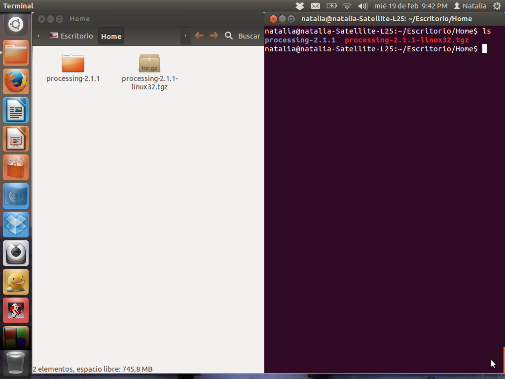

El comando anterior, sirve para descomprimir el archivo que acabaste de descargar.
Luego, para acceder a esa carpeta, escribiremos lo siguiente en la terminal:

```
cd processing-xxxx
````
y presionamos la tecla enter.


Si quieres ver el contenido de la carpeta, escribe el comando _ls_, que significa listar todos los elementos que tenemos en la carpeta.
Finalmente para hacer correr Processing, escribimos

```
./processing
```

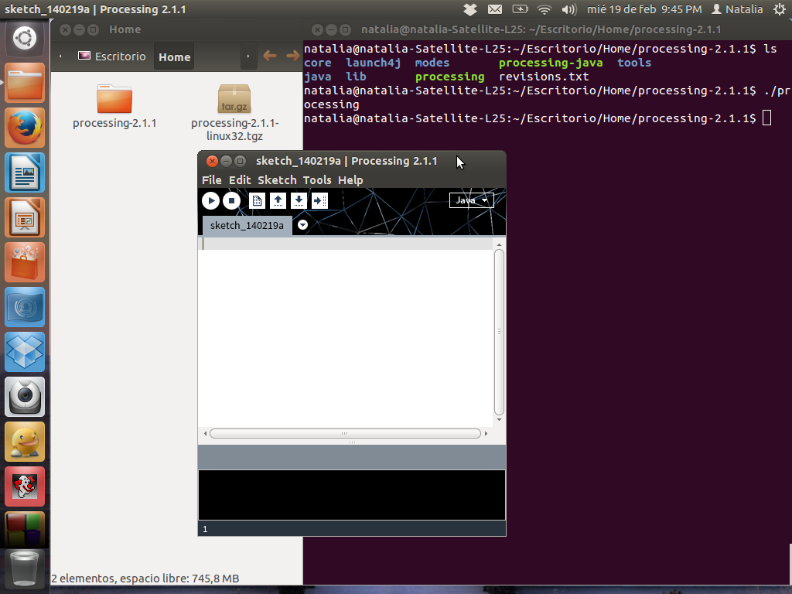

con algo de suerte y un poco de paciencia, podrás ver el IDE de Processing en tu pantalla. Todos los setups son diferentes, si posees algún problema y el programa no empieza, podrás empezar de otra manera, dirigirte a los foros, donde haya podrán resolverte el problema. [foro](http://wiki.processing.org/index.php/Troubleshooting)

2.En Windows, tendrás un archivo .zip. Haz doble click, y arrastra la carpeta dentro de una ubicación en tu disco duro. Podría ser Archivos de programa o simplemente tu escritorio, pero lo importante es que la carpeta Processing sea colocada fuera de ese archivo .zip. Luego das doble click a processing.exe para empezar.

3.En Mac OSX, la versión esta en un archivo de imagen de disket (.dmg). Arrastra el icono de Processing a la carpeta Applications. Si algunas veces usas ese computador y no es posible modificar la carpeta Applications, solo arrastra la aplicación al escritorio. Entonces haga doble click en el icono de Processing para empezar. 


_7 Directorio:_ En la terminal, directorio suele nombrarseles a las carpetas de nuestro computador.

###  Nuestro primer programa: Dibujando un circulo.

__Antes de empezar:__ Todos los ejemplos de código de este tutorial, están alojados en este repositorio de git, en la carpeta llamada Getting started. 


Ahora que tenemos funcionando el entorno de desarrollo Processing. Describiremos un poco que posee, la parte blanca larga es el editor de texto y es allí donde escribiremos las líneas de código. La fila de botones en la parte superior se llama barra de herramientas y de izquierda a derecha tenemos los botones de:


1. __Play:__ ejecuta nuestro código.
2. __Stop:__ para nuestro código.
3. __New:__ abre una ventana nueva.
4. __Open:__ abre un archivo guardado en nuestro computador.
5. __Save:__ guarda nuestro programa en el computador.
6. __Export:__ exporta nuestro programa como una aplicación de escritorio.
Debajo del editor de texto tenemos la consola, que es una área de mensajes que nos mostrara detalles técnicos de nuestro código. La analizaremos mas adelante.
Por ahora empezaremos con nuestro primero programa en Processing.

### Ejemplo 1 Dibujando un Circulo.

En el editor, escribe lo siguiente:

```
ellipse(50, 50, 80, 80);
```


Esta línea de código es un método para “dibujar un circulo”, felicidades, haz realizado tu primer programa en Processing ¡.

No entraremos en detalles sobre esta línea de código, simplemente estamos iniciando con una pequeña muestra sobre lo que podemos hacer con Processing, mas adelante entraremos en detalles.

Si tienes escrita la línea correctamente, podrás ver una imagen de un circulo. Si tu escritura es errónea, se mostrará en la consola un mensaje de color rojo, indicando algunas veces el error. Si esto sucede, es mejor que copies el código del ejemplo exactamente. Los números deberían estar dentro del paréntesis y tener comas después de cada uno de ellos, la línea debería finalizar cerrando un paréntesis y con punto y coma.  

Una de las cosas complicadas para empezar con la programación, es que siempre tienes que estar especificando la sintaxis de la línea. El software Processing no es siempre lo suficientemente inteligente para saber que quieres decir, y puede ser bastante exigente sobre la colocación de la puntuación. Puedes acostumbrarte con la practica.

Después, seguiremos adelante con nuestro [8]sketch que se pondrá mas interesante.

### Ejemplo 2 Dibujando círculos

Borra la línea de código anterior, y ahora prueba este código:


```
void setup()
{
  size(480, 120);
  smooth();
}

void draw()
{
  if (mousePressed)
  {
    fill(0);
  } 
  else
  {
    fill(255);
  }
  
  ellipse(mouseX, mouseY, 80, 80);
}
```
Hablemos un poco sobre este programa: este programa crea un ventana de 480 pixeles de ancho y 120 pixeles de alto; y dibuja círculos en la posición del mouse. Cuando el botón del mouse es presionado, el color de circulo cambia a negro, y cuando se suelta vuelve a su color original.
Explicaremos mas adelante los detalles de este código, por ahora; corre el código, mueve el mouse y diviértete ☺.

### Atajos.

Si no queremos usar los botones, siempre puedes usar los atajos del teclado. Para correr el sketch puedes teclear Ctrl-R (en Windows y linux) o Cmd-R en Mac.
Puedes usar también la opción Present, que mostrara tu sketch en pantalla completa, ideal para presentaciones o instalaciones. La puedes encontrar en el menú sketch en Processing.
Para guardar tu proyecto puedes usar el icono anteriormente mencionado o usar Ctrl-S (Windows y linux) o Cmd-S (Mac). Por defecto, todos tus sketch estarán guardados en “sketchbook”. Que es una carpeta que guarda tus programas para un fácil acceso. Normalmente esta alojada en el directorio documentos en tu computadora.
Clicando sobre el botón abrir en la barra de herramientas (la flecha apuntando hacia arriba) podremos abrir una lista de todos tus programas (sketches) en tu carpeta sketchbook, también hay una lista con ejemplos instalados en el software Processing.
A menudo es bueno obtener correctas rutinas de programación, y una de ellas es guardar nuestro trabajo, pues Processing no dispone de una función de auto-guardado. Cuando se trata de diferentes procesos bajo una misma idea, guardarlos con diferentes nombres es ideal para tener diferentes versiones, además de volver a nuestra versión anterior. También puedes observar donde está ubicado el sketch en tu disco con la opción show bajo el sketch menú. 
Si presionas el botón new, reemplazaremos el sketch presente en la ventana, con un sketch limpio. Ctrl-N (Linux y Windows) o Cmd-N (Mac) para crear un nuevo sketch, o File -> New para crear igualmente la ventana.

__8 sketch:__ Suele llamárseles a los programas realizados en processing. 

### Exportando/compartiendo.

Otro tema importante de Processing es compartir tu trabajo. El botón de exportar en la barra de herramientas. (flecha apuntando hacia la derecha).
Este botón lo que hace es que agrupa todo tu código en una sola carpeta llamada applet, que se puede descargar desde un servidor web. Después de exportar, la carpeta applet puede abrirse en el escritorio. 

### Ejemplos y referencia

Aprender a programar con Processing implica explorar muchos códigos: correrlos, alterarlos, romperlos, y repasarlos hasta tener algo nuevo en base a la experimentación. Con esto en mente, en la descarga del software Processing se incluyen decenas de ejemplos de demostración, con diferentes características del software. Para abrir los ejemplos, selecciona ejemplos desde el menú File o clickea el icono en la barra de herramientas. Los ejemplos están agrupados por categorías según su función, forma y funcionamiento.
Si ves una parte del programa con la cual no estás familiarizado y es de color naranja (esto es un [9]método de una parte del Processing), selecciona esa palabra, click derecho (en Windows o ctrl-click en Mac) y selecciona “find in Reference” y entraras al menu de ayuda. Abrirás la referencia en un navegador web para el elemento del código seleccionado. La referencia también está disponible online en [referencia](http://www.processing.org/reference/.)

La referencia de Processing explica cada elemento de código con una descripción y algunos ejemplos. La referencia usualmente son programas muy cortos (usualmente cuatro o cinco líneas) y son más fáciles de entender que los códigos largos en la carpeta de ejemplos. Recomendamos abrir la referencia cuando estés leyendo este libro y cuando estés programando. 

__9 metodo:__  Suele llamarsele metodo a una porción de codigo que esta dentro de una clase y que tiene alguna funcionalidad.


## Capitulo 3: Dibujo.

### Formas básicas.

Lo primero que hay que saber, es que dibujar sobre una pantalla de computador es como trabajar en una hoja cuadriculada. Primero empezamos paso por paso, teniendo un proceso técnico cuidadoso. Empezaremos dibujando formas simples que luego se expandirán a la animación y la interacción. Pero empecemos por el principio.
Una pantalla de computador es una red de luces con elementos llamados pixeles. Cada pixel tiene una posición en la pantalla definida por coordenadas. El eje de coordenadas x es la distancia horizontal desde el origen y el eje de coordenadas y es la distancia vertical. En Processing, el origen es la esquina superior izquierda de la ventana de representación y coordina los valores hacia abajo y hacia la derecha. La imagen de la izquierda muestra el sistema de coordenadas, y la imagen de la derecha muestra varias posiciones en la rejilla:


Como muestra el ejemplo anterior, si queremos dibujar un pixel en la pantalla; lo llevaremos a cabo de la siguiente manera: Si la pantalla es de 100 por 100 pixeles (Grafica anterior izquierda) entonces podemos decir que la coordenada superior izquierda es de (0, 0) ⇔ (x, y). El centro esta en (50, 50) ⇔(x, y). Y la izquierda de abajo es (99, 99) ⇔ (x, y). Pero esto parece algo confuso, ¿ Porque si el tamaño es de 0 a 100 vamos a recorrerlo de 0 a 99 ?, la respuesta es sencilla, en computación, el cero también es un numero, entonces; si tenemos una cantidad de 1 a 10, realmente tenemos de 0 a 9.

La pantalla es creada y las imágenes son dibujadas adentro de esta a través de elementos del código llamados funciones. Las funciones son los ladrillos básicos de un programa de Processing. El comportamiento de una función es definida por sus parámetros, por ejemplo; al menos cada programa de Processing tiene una función de _size()_ para establecer el ancho y el alto de la pantalla de dibujo. (Si el programa no tiene una función de _size()_, Processing establece una determinada de 100 x 100 pixeles).

### Ejemplo 1. Dibujar una ventana.

La función _size()_ tiene dos parámetros: el primero establece el ancho de la ventana y el segundo establece el alto de la ventana. Para dibujar una ventana que sea de 800 pixeles de ancho y 600 pixeles de alto, se escribe:

```
Size(800, 600);
```

Corra este línea de código para ver el resultado. Experimente a escribir diferentes números para ver que resulta. Intente con números muy pequeños y números mas grandes que los de su ventana.

### Ejemplo 2. Dibujar un punto.

Para establecer el color de un solo pixel en la ventana, usamos la función _point()_. Esta tiene dos parámetros que definen su posición: la coordenada x seguida de la coordenada y. Para dibujar una pequeña ventana y un punto en el centro de la pantalla, debería escribir _size()_ seguida de la función _point()._

```
size(200, 200);
point(100, 100);
```


### Formas básicas.

Processing incluye un grupo de funciones para dibujar formas básicas. Las formas simples como las líneas pueden ser combinadas para crear formas más complejas como una hoja o una cara. Para dibujar una sola línea, necesitamos cuatro parámetros: dos para fijar las coordenadas x y y iniciales y otras dos coordenadas x y Y  para las posiciones finales.

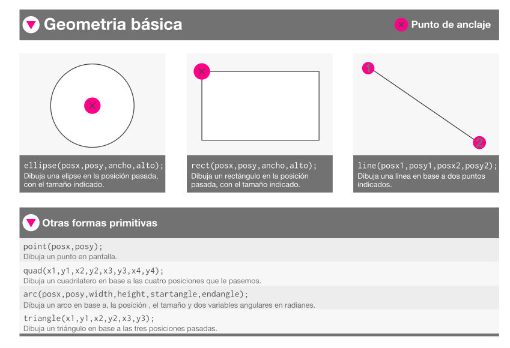

### Ejemplo 2: Dibujar una línea.

Para dibujar una línea entre las coordenadas (20, 50) y (420, 110), intenta:

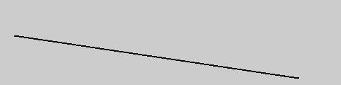

```
size(480, 120);
line(20, 50, 420, 110);
```

### Ejemplo 3: Dibujando formas básicas.

Siguiendo este patrón, un triángulo necesita seis parámetros y un cuadrilátero necesita 8 (un par por cada punto):

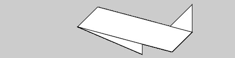

```
size(480, 120);
quad(158,55,199,14,392,66,351,107);
triangle(347,54,392,9,392,66);
triangle(158,55,290,91,290,112);
```

### Ejemplo 4: dibujando un rectángulo

Los rectángulos y círculos son definidos con cuatro parámetros: el primero y el segundo son para las coordenadas X y Y del punto de anclaje, el tercero y cuarto para el ancho y alto. Para hacer un rectángulo con las coordenadas (180,60) con un ancho de 220 pixeles y un largo de 40, usa la función _rect()_ así:

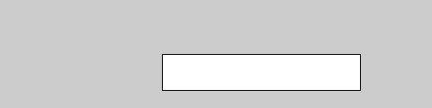

```
size(480, 120);
rect(180, 60, 220, 40);
```

### Ejemplo 5: dibujar un circulo.

Las coordenadas x y Y de un rectángulo son las de la esquina superior izquierda, pero en un circulo son las del centro de la forma. En este ejemplo, notamos que la coordenada Y para el primer circulo esta fuera de la ventana. Los objetos pueden ser dibujados parcialmente (o enteramente) fuera de la ventana sin ningún error.

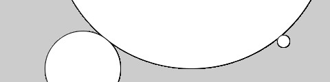

```
size (480,120);
ellipse (278,-100,400,400);
ellipse (120,100,110,110);
ellipse (412,60,18,18);
```

### Ejemplo 6: dibujar parte de un circulo (arcos).

La función arc() dibuja parte de un circulo.

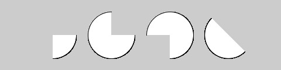

```
size (480,120);
arc (90,60,80,80,0, HALF_PI);
arc (190,60,80,80,0, PI+HALF_PI);
arc (290,60,80,80, PI, TWO_PI+HALF_PI);
arc (390,60,80,80, QUARTER_PI, PI+QUARTER_PI);
```

En esta función, el primer y segundo parámetro establecen la ubicación, el tercero y cuarto establecen el ancho y el largo. El quinto parámetro establece el ángulo para empezar el arco, y finalmente, el sexto fija donde para el ángulo. Los ángulos están establecidos en [10]radianes, en lugar de grados. Los radianes son ángulos de medición basados en el valor de pi (3.14159). En el siguiente grafico se muestra como ambos se relacionan. Tal como se presenta en este ejemplo, cuatro valores de radian son reemplazados por nombres especiales, para estos fue agregada una parte de Processing. Los valores PI, QUARTER_PI, HALF_PI, y TWO_PI pueden ser usados para reemplazar el valor de 180, 45, 90, 360, radianes.

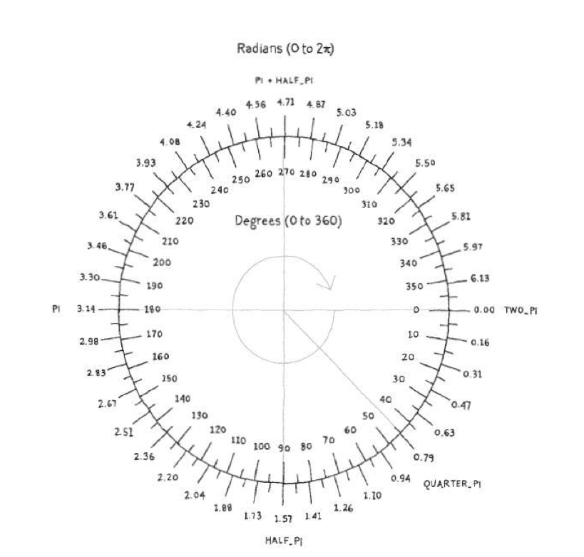

### EJERCICIOS !!!

Intenta escribir un programa que dibuje 4 líneas y que toque cada esquina de tu pantalla. Intenta dibujar líneas verticales, horizontales y diagonales. Mira un ejemplo aquí:


Solucion.

```
size(500, 500);
line(0, 0, 500, 500);
line(500, 0, 0, 500);
line(0, 250, 500, 250);
line(250, 0, 250, 500);
```
__10 radianes:__ Representa el ángulo central en una circunferencia y abarca un arco cuya longitud es igual a la del radio. 

## Orden de los dibujos.

Cuando un programa de computadora esta corriendo, el computador empezará por la primera línea de código escrita y terminara en la ultima escrita, después parará. Tener esto en mente es importante, porque así tendremos en cuenta cual será el ultimo dibujo que veremos en pantalla. 

### Ejemplo 7: Orden de los dibujos.

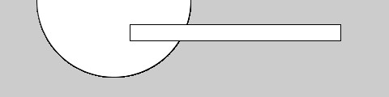

```
size (480,120);
ellipse (140,0,190,190);
// El rectángulo se dibuja encima del circulo
// Porque viene después en el código
rect (160,30,260,20);
```

Se puede pensar como si estuviéramos dibujando un circulo y un rectángulo. Si primero dibujamos el circulo y luego el rectángulo encima del circulo. Una zona del circulo no será expuesta debido a que el rectángulo opaca esa zona.

## Propiedades de las formas.

En Processing, las formas básicas tienen una funciones que determinan de que forma ellas se trazaran el la pantalla. Veremos las mas básicas pero existen muchas otras. 
La función _smooth()_ alisa los bordes de las líneas dibujadas en la pantalla, mezclando los bordes con el valor del pixel más cercano. Si el alisamiento ya esta fijado, por el contrario, la función _noSmooth()_ desmontara la funcionalidad de alisado. 


### Ejemplo 8: _smooth()_

```
size (480,120);
smooth(); //  Fijamos el alisado
ellipse(140, 60, 90, 90);
noSmooth();// Apagamos el alisado
ellipse(240, 60, 90, 90);
```

__NOTA:__ Algunas de las implementaciones de Processing (como la versión para JavaScript) siempre serán formas lisas; otras podrían no admitir el alisado del todo. En algunas situaciones, no es posible activar y desactivar el alisado entre el mismo dibujo a través de _draw()_. Ver la referencia _smooth()_ para más detalles. 

### Ejemplo 9: Establecer el grosor de las formas.

El grosor del los trazos, normalmente esta establecido a un solo pixel, pero esto puede ser modificado con la función _strokeweight()_. Este solo parámetro puede modificar el grosor del contorno de las formas.


```
size (480,120);
smooth ();
ellipse (75,60,90,90);
strokeWeight (8); // Grosor del trazo de 8 pixeles 
ellipse (175,60,90,90);
ellipse (279,60,90,90);
strokeWeight(20); // Grosor del trazo de 20 pixeles
ellipse (389,60,90,90);
```

### Ejemplo 10: Estableciendo los atributos del trazo.

La función _strokeJoin()_ cambia la forma en la que las líneas son unidas (como se muestra en las dos primeras formas), y la función _strokeCap()_ cambia como las líneas son dibujadas desde el principio hasta el final.

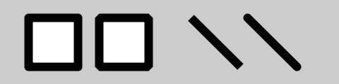

```
size(480,120);
smooth ();
strokeWeight(12);
strokeJoin(ROUND);  
rect(40,25,70,70);
strokeJoin (BEVEL); // bisel de la esquina del trazo 
rect (140,25,70,70);
strokeCap (SQUARE); // los finales de línea son cuadrados 
line(270,25,340,95);
strokeCap (ROUND); // los finales de línea son redondos 
line(350,25,420,95);
```

__NOTA:__ La colocación de formas como _rect()_ y _ellipse()_ son controladas con las funciones _rectMode()_ y _ellipseMode()_. Compruebe la referencia __(Help -> Reference)__ para ver los ejemplos de cómo ubicar rectángulos desde su centro (mejor que desde la esquina superior izquierda), o para dibujar circulos desde su esquina superior izquierda como los rectángulos.

### Color.

Hasta ahora todas las forma se han llenado de blanco con líneas negras, y el fondo de la pantalla de dibujo ha tenido una luz gris. Para cambiarlos, usa las funciones _background()_, _fill()_ y _stroke()_. Los valores de estos parámetros están en el rango de 0 a 255, cuando 255 es blanco, 128 es gris medio, y 0 es negro. Esto se ilustra mejor en el siguiente grafico


Una muestra de diferentes valores de gris en un fondo negro. 


```
size (480, 120);
smooth ();
background (0);               // Negro
fill (204);                   // Gris claro
ellipse (132, 82, 200, 200); 
fill (153) ;                 //  Gris medio oscuro
ellipse (228, -16, 200,200 );
fill(102);                    // Gris oscuro
ellipse (268, 118, 200, 200); 
```

### Controlando el relleno y el trazo.

Puedes inhabilitar el trazado así que habrá trazo sin _nostroke()_ y puedes inhabilitar el relleno de una forma con _noFill()_.


```
size (480, 120);
smooth ();
fill (153);
ellipse (132, 82, 200, 200);
noFill();
ellipse (228, -16, 200, 200);
noStroke ();
ellipse (268, 118, 200, 200); //  no se dibuja
```

Sea cuidadoso de no inhabilitar el relleno y el trazo al mismo tiempo, como lo hemos hecho en el ejemplo anterior. Porque nada quedará dibujado en la pantalla.

### Dibujar con color

Para ir más allá de los valores de la escala de grises, usaremos 3 parámetros para especificar las componentes rojo, verde y azul de un color. 


```
size (480, 120);
noStroke ();
smooth ();
blackground (0, 26, 51);
fill (255, 0, 0); //  rojo
ellipse (132, 82, 200, 200);
fill (0, 255, 0); // verde
ellipse (228, -16, 200, 200);
fill (0, 0 , 255); // Azul
ellipse (268, 118, 200, 200);
```

Por defecto, podemos trabajar color en escala de grises o color RGB, el cual viene de la definición del color de las pantallas de los computadores. Los tres valores standard son rojo, verde y azul; y su rango que va desde 0 a 255. La forma en que los valores del gris lo hacen usando el color RGB no es muy intuitiva, así que para escoger los colores, usa Tools -> color selector (herramientas-> seleccionar el color), el cual te muestra una paleta de colores similar a la que se encuentra en cualquier software. Selecciona un color, y luego usa los valores R, G y B como parámetros para las funciones _background()_, _fill()_ o _stroke()_.

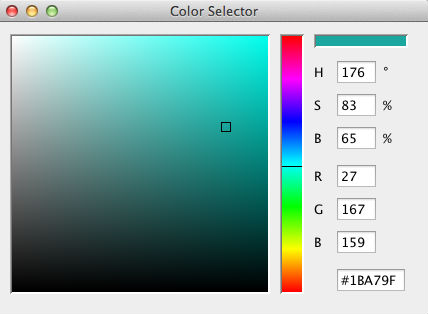

### Transparencia

Agregando un cuarto parámetro adicional a _fill()_ o _stroke()_, puedes controlar la transparencia. Este cuarto parámetro es conocido como el valor alpha, y también se usa dentro del rango de 0 a 255 para establecer la cantidad de transparencia. El valor 0 define el color como transparente total (no se mostrará), el valor 255 es totalmente opaco, y los valores entre estos extremos causan que los colores se mezclen en la pantalla.


```
size (480, 120);
noStroke();

smooth ();

background (204,226,225); 
fill ( 255, 0, 0, 160); 
ellipse (132, 82, 200, 200);
fill (0, 255, 0, 160); 
ellipse (228, -16, 200, 200);
fill (0, 0, 255, 160); 
ellipse (268, 118, 200, 200);
```
 
### Formas personalizadas.

No estás limitado a usar las figuras geométricas básicas, también puedes definir nuevas formas conectando una serie de puntos.

### Ejemplo 11: Dibujar una flecha.

La función _begindShape()_ señala el comienzo de una nueva forma. La función _vertex()_ es usada para definir cada par de coordenadas X y Y para la forma. Finalmente, _endShape()_ es utilizada para señalar que la forma a sido terminada.

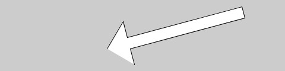

```
size (480,120);
beginShape ();
vertex (180, 82);
vertex (207, 36);
vertex (214, 63);
vertex (407, 11);
vertex (412, 30);
vertex (219, 82);
vertex (226, 109);
endShape();
```

### Ejemplo 12: Cerrando las formas personalizadas.

Cuando se ejecuta el código anterior, puedes ver que el primer y el último punto no están conectados. Para hacer esto, agrega la palabra CLOSE (cerrar) como un parámetro en _endShape()_ así:

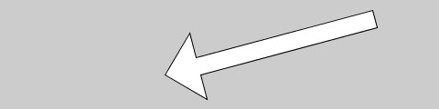

```
size (480, 120);
beginShape();
vertex (180, 82);
vertex (207,36);
vertex (214, 63);
vertex (407, 11);
vertex (412, 30);
vertex (219, 82);
vertex (226, 109);
endShape (CLOSE);
```

### Comentarios.

Los ejemplos de este capítulo usan doble slash // al final de una línea para agregar comentarios en el código. Los comentarios hacen parte del programa y son ignorados cuando el programa está corriendo. Son útiles para hacer notas explicando que hay en el código. Si otro está leyendo tu código, los comentarios son especialmente importantes para ayudar a entender tu proceso de pensamiento.

Los comentarios son especialmente importantes para diferentes opciones, como cuando estamos intentando escoger el color correcto. Así que, por ejemplo, podría estar intentando encontrar el rojo correcto para un circulo:
```
size (200, 200);
fill (165, 57, 57);
ellipse (100, 100, 80, 80);
```

Ahora supongo que quiero intentar con otro rojo diferente, pero no quiero perder el viejo. Puedo copiar y pegar la línea, hacer un cambio, y luego “comentar” el viejo:

```
size (200, 200);
//fill (165, 57, 57);
fill (144, 39, 39);
ellipse (100, 100, 80, 80);
```

Colocando // al comienzo de la línea se desactiva temporalmente. O puedo remover el // y colocarlo en frente de la otra línea si quiero intentarlo de nuevo:

```
size (200, 200);
fill (165, 57, 57);
//fill (144, 39, 39);
ellipse (100, 100, 80, 80);
```
### Proyecto 1.

Finalizado un capitulo, realizaremos un proyecto. Esta vez realizaremos un pequeño dibujo en Processing a partir de un boceto, con este boceto; iremos trabajando cada final del proyecto, añadiéndole funcionalidades y aplicando todo lo aprendido finalizando cada capitulo.

Para empezar una idea visual, es ideal primero dibujar, crear un pequeño boceto de que es lo que se quiere plasmar en la pantalla.

Yo escogí un satélite, porque me parecen una tecnología muy interesante y visualmente atractiva.

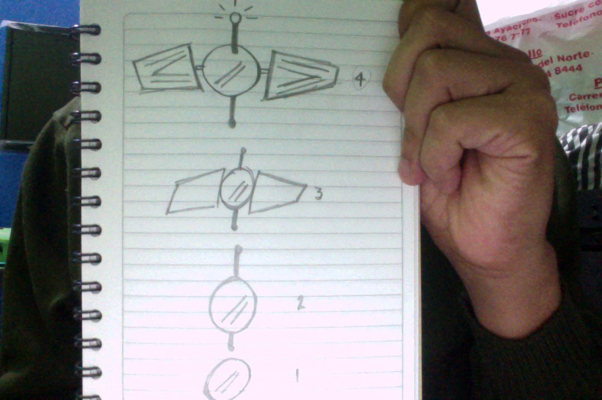

Aproximadamente, la forma en Processing visualmente queda así:

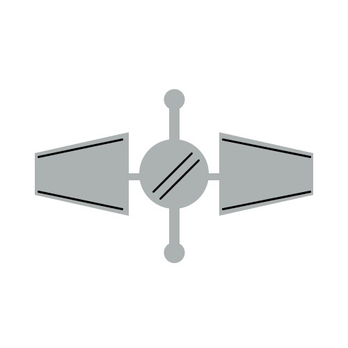

```
//  Proyecto 1

size(500, 500);
smooth();

// color del fondo
background(255);

//  Centro del satelite
ellipseMode(CENTER);
fill(172, 178, 177);
noStroke();
ellipse(250, 250, 100, 100);

strokeWeight(3);
stroke(0);
line(220, 275, 275, 220);
line(230, 285, 285, 230);

//  antena
rectMode(CORNER);
noStroke();
rect(243, 150, 15, 60);
rect(243, 290, 15, 60);

ellipseMode(CENTER);
noStroke();
ellipse(250.5, 363, 30, 30);
ellipse(250.5, 143, 30, 30);

//  Laterales
rectMode(CORNER);
rect(185, 249, 20, 10);
rect(295, 249, 20, 10);

//  alas
quad(  50, 220, 185, 190, 185, 310, 50, 280);
quad( 315, 190, 450, 220, 450, 280, 315, 310);
stroke(0);
strokeWeight(3);
line(55, 225, 175, 200);
line(55, 275, 175, 300);
line(320, 300, 445, 275);
line(320, 200, 445, 225);
```

__NOTA:__ Todos los codigos escritos en este tutorial, estan en la carpeta de este repo llamada Getting Started.

## Capitulo 4: Variables.

### Haciendo variables.

Cuando se esta programando, necesariamente se necesitan valores que cambian todo el tiempo y generalmente esos valores suelen ser variables.
Una variable esta formada por dos partes; un espacio en memoria y un nombre simbólico asociado a dicho espacio.

Cuando la variable esta declarada y asignada, el programador puede hacer uso de ella después en el programa las veces que quiera.

La razón principal por la que usamos las variables es para evitar la repetición de líneas en el código. Si estás escribiendo el mismo número más de una vez, considera marcarlo en una variable para hacer tu código más general y fácil de actualizar.

### Ejemplo 1: reutilizar el mismo valor.

Por ejemplo, cuando haces la coordenada Y, y el diámetro para los dos círculos en este ejemplo en variables, los mismos valores son usados para cada circulo:

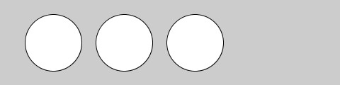

```
size (480, 120);
smooth ();
int y = 60;
int d = 80;
ellipse (75, y, d, d);  // izquierdo
ellipse (175, y, d, d); // mitad
ellipse (275, y, d, d); // derecha
```
### Ejemplo 2: cambiar los valores de las variables.

Cambiando simplemente las variables y y d se alteran los 3 círculos:

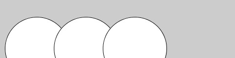

```
size (480, 120);
smooth ();
int y = 100;
int d = 130;
ellipse (75, y, d, d);  // izquierdo
ellipse (175, y, d, d); // mitad
ellipse (275, y, d, d); // derecha
```

Sin las variables, necesitarías cambiar la coordenada _Y_ usada en el código tres veces y el diámetro seis veces. Las variables te permiten separar las líneas del código que cambian desde las líneas que no lo hacen, lo cual hace el programa más fácil de modificar. Por ejemplo, si colocas variables que controlan los colores y el tamaño de las formas en un lugar, luego puedes rápidamente explorar diferentes opciones visuales concentrándose en unas cuantas líneas de código.
Cuando haces tus propias variables, determina el _nombre_, el _tipo de dato_ , y _el valor_. Tú decides cómo llamar a la variable. Escoge un nombre que te informe acerca de lo que guarda la variable, pero que sea consistente y no demasiado detallado. Por ejemplo, el nombre de la variable “radio” será mas claro que “r” cuando mires el código después.
EL rango de valores que puede ser almacenado entre una variable es definido por su tipo de dato. Por ejemplo, el típico numero entero de dato que puede guardar números sin decimales (números enteros) en código, es abreviado a _int_ . Hay tipos de variables para guardar cada tipo de dato: enteros (__int__), decimales (__float__), caracteres (__char__), palabras (__string__), etc.

Las variables deben ser declaradas primero, lo que deja a un lado el espacio en la memoria del computador para guardar información. Cuando declaramos una variable, se necesita especificar su tipo de dato (como __int__), lo cual indica que tipo de información será guardada. Después de establecer el nombre y el tipo de dato, este puede ser asignado a un valor para la variable:

```
int x;  // Declare x es una variable entera
x = 12; // Asigna una valor a la variable x
```

Este código hace lo mismo, pero es más corto:

```
int x = 12; // Declara que x es una variable entera y asigna un valor
```

El nombre del tipo de dato está incluido en la línea de código que declara a la variable, pero no se vuelve a escribir. Cada vez que se escribe el tipo de datos en frente del nombre de la variable, el computador piensa que estás tratando de declarar una nueva variable. No puedes tener dos variables con el mismo nombre en la misma parte del programa, así el programa tendría un error:

```
int x; // Declara x como una variable entera
int x = 12; 
// ERROR! no puedes tener dos variables llamadas x
```

### Las variables (constantes) de Processing.

Processing tiene una serie de variables especiales para almacenar información acerca del programa mientras este corre. Por ejemplo, el largo (__width__) y el alto (__height__). Estos valores son establecidos por la función _size()_. Estos pueden ser usados para dibujar elementos relativos al tamaño de la ventana, incluso si la línea _size()_ cambia.

### Ejemplo 3: ajustar el tamaño.

En este ejemplo, cambiamos los parámetros en base a  _size()_, para ver como funciona:

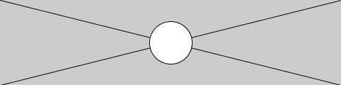

```
size (480, 120);
smooth ();
line (0, 0, width, height); // Linea desde (0,0) a (480, 120) 
line (width, 0, 0, height); // Linea desde (480, 0) a (0,120) 
ellipse (width/2, height/2, 60, 60);
```

Otra variable especial le hace seguimiento al estado del valor del mouse y el teclado y mucho más. Estos son discutidos en el capítulo 5.

### Un poco de Matemáticas.

La gente a menudo asume que las matemáticas y la programación son lo mismo. Aunque el conocimiento de matemáticas puede ser muy útil para cierto tipo de código, la aritmética básica cubre las partes más importantes.

### Ejemplo 4: Aritmética básica.

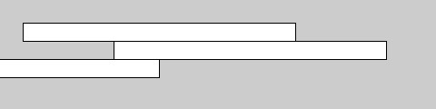

```
size (480, 120);
int x = 25;
int h = 20;
int y = 25;
rect (x, y, 300, h);       // arriba
x = x + 100; 
rect (x, y + h, 300, h);   // mitad
x = x - 250;
rect (x, y + h*2, 300, h); // Abajo
```

En código, los símbolos como ( + ), ( - ), y  ( * )
son colocados entre dos valores, los valores como
9 y 1024 - 512 son expresiones. Los operadores para las operaciones matemáticas básicas son:

1. + Adición
2. - Sustracción
3. * Multiplicación
4. / División
5. = Asignación

Processing tiene reglas establecidas para definir cuáles operadores tiene prioridad sobre los demás, es decir cuales cálculos se hacen primero, segundo, tercero, y así sucesivamente. Estas reglas se definen en el orden en el cuál el código está corriendo. Un poco de conocimiento acerca del largo camino para la comprensión de cómo funciona una línea corta de código como este:

```
int x = 4 + 4 * 5; // Asigna 24 a la variable x
```

La expresión 4 * 5 es evaluada primero porque la multiplicación tiene mayor prioridad. Segundo, 4 es agregado al producto de 4 * 5 para dar 24. Por último, el operador asignación (el símbolo de igual) tiene la menor prioridad, el valor 24 es asignado a la variable x. Esto es clarificado con un paréntesis, pero el resultado es el mismo:

```
int x = 4 + ( 4 * 5 ); // Asigna 24 a la variable x
```

Si quieres forzar para que la adición sea primero, sólo tienes que mover el paréntesis. Porque el paréntesis tiene la mayor prioridad que la multiplicación, el orden es cambiado y el cálculo es afectado:

```
int x = ( 4 + 4 ) * 5; // Asigna 40 a la variable x
```

Un acrónimo para este orden es enseñado en clases de matemáticas: PEMDAS, el cual se encuentra en paréntesis, exponentes, multiplicaciones, divisiones, adiciones y sustracciones, donde el paréntesis tiene la mayor prioridad y la sustracción la menor. El orden completo de operaciones se encuentra en los apéndices.

Algunos cálculos son usados más frecuentemente en programación que los métodos abreviados que se han desarrollado; siempre es bueno guardar algunas pulsaciones de tecla. Por ejemplo, le puedes agregar a una variable, o sustraer de ella, con un sólo operador:

```
x += 10; // Esto es igual a x=x+10
y -= 15; // Esto es igual a y=y-15
```

Es también común agregar o sustraer 1 de una variable, así que los atajos existen para esto también. Los operadores ++ y -- hacen esto:

```
x++; // Esto es igual a x = x + 1 
y--; // Esto es igual a y = y - 1
```

Más atajos pueden ser encontrados en la referencia.

### Repetición

A medida que escribes más programas, notarás que los patrones se asemejan cuando las líneas de código se repiten. Pero con leves variaciones. Una estructura de código es llamada for loop para hacer posible correr una línea de código más de una vez para condensar este tipo de repetición en menos líneas. Esto hace más modular tu programa y más fácil de cambiar.

### Ejemplo 5: Hacer lo mismo una y otra vez.

Este ejemplo tiene el tipo de patrón que puede ser simplificado para _for loop_:

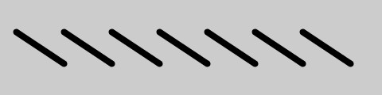

```
size (480, 120);
smooth ();
strokeWeight (8);
line (20, 40, 80, 80);
line (80, 40, 140, 80);
line (140, 40, 200, 80);
line (200, 40, 260, 80);
line (260, 40, 320, 80);
line (320, 40, 380, 80);
line (380, 40, 440, 80);
```

### Ejemplo 6: Usa un for loop.

La misma cosa puede ser hecha por un for, y menos líneas de código:

```
size (480, 120);
smooth ();
strokeWeight (8);

for (int i = 20; i < 400; i += 60)
 {
   line (i, 40, i + 60, 80);

 }
```

El _for loop_ es diferente, en varias formas del código que hemos escrito hasta ahora. Notarás los paréntesis y los corchetes. El código entre los paréntesis es llamado bloque. Este es el código que será repetido en cada iteración del for loop.
Dentro de los paréntesis hay tres declaraciones, separadas por punto y coma, que trabajan juntos para controlar cuántas veces corre el código dentro del bloque. De izquierda a derecha, estas declaraciones se refieren a la __inicialización (init)__, __el condicional (test)__, y __el incremento (update)__:

```
for (init; test; update) 
{
statements
}
```

Típicamente el __init__ declara una nueva variable para usar dentro de for loop y asignar un valor. El nombre de la variable __i__ es usado frecuentemente, pero no tiene nada de especial. __El condicional__ evalúa el valor de esta variable, y __el incremento__ cambia el valor de la variable. La siguiente imagen muestra el orden en el cuál estos corren y como controlan la declaración del código dentro del bloque.

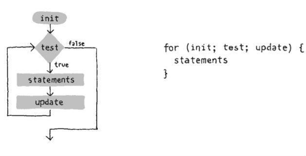

La declaración del __condicional__ requiere más explicación. Siempre es una __expresión relacional__ que compara dos valores con un __operador relacional__. En este ejemplo, la expresión es “i < 400” y el operador es el símbolo < (menor que). Los operadores relacionales más comunes son:

```
> Mayor que
< Menor que
>= mayor o igual que

<= Menor o igual que
== Igual que

!= Diferente que 
```

La expresión relacional siempre evalúa a __verdadero o falso__. Por ejemplo, la expresión 5 > 3 es verdadera. Podemos preguntar, “es cinco mayor que 3”.La respuesta es “sí”. Entonces decimos que la expresión es verdadera.

Para la expresión 5 < 3, preguntamos, “es cinco menor que tres?” Porque la respuesta es “no”, entonces decimos que la expresión es falsa. Cuando la evaluación es verdadera, el código dentro del bloque está corriendo, y cuando es falsa, el código dentro del bloque no está corriendo y el for loop termina.

### EJERCICIO.

Trata de dibujar la siguiente figura usando un for loop.

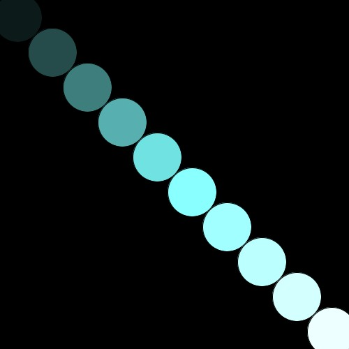

__Solución__

```
size (500, 500);
smooth ();
background(0);
for (int i = 25; i < width; i += 50)
{
  fill( i / 2 , i + 1 , i  );
  ellipse (i, i, 70, 70);
}
```

### Ejemplo 7: Mas de foor loop. 


```
size (480, 120);
smooth ();
strokeWeight (2);
for (int i =20; i <400; i +=20)
{
  line (i, 0, i + i/2, 80);
}
```

### Ejemplo 8: Incrustar un for loop a otro.

Cuando un for loop es incrustado dentro de otro, el número de repeticiones es multiplicado. Primero, miremos un corto ejemplo, y luego lo descomponemos.


```
size (480, 120);
background (0);
smooth ();
noStroke ();
for (int y = 0; y <= height; y += 40)
{
  for (int x = 0; x <= width; x += 40)
  {
    fill (255, 140);
    ellipse (x, y, 40, 40);
  }
}
```

### Ejemplo 9: Filas y columnas.

En este ejemplo, el for loop es adyacente, en lugar de uno incrustado dentro de otro. El resultado muestra que un for loop está dibujando una columna de 4 círculos y el otro está dibujando una fila de 13 círculos:

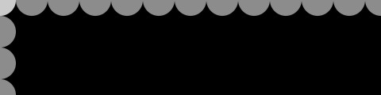

```
size (480, 120);
background (0);
smooth ();
noStroke ();
for (int y = 0; y < height+45; y += 40)
{ 
  fill (255, 140);
  ellipse (0, y, 40, 40);
}
for (int x = 0; x < width+45; x += 40) 
{
  fill (255, 140);
  ellipse (x, 0, 40, 40);
}
```

Cuando uno de estos for loops es colocado dentro de otro, las cuatro repeticiones del primer loop son agravadas con las trece del segundo en orden para correr dentro del bloque incrustado 52 veces (4 x 13=52).
El ejemplo 8 es una buena base para explorar varios tipos de patrones de repetición visual. 
Los siguientes ejemplos muestran un par de formas que pueden ser extendidas, pero este es sólo una pequeña muestra de lo que es posible. En el ejemplo 10, el código dibuja una línea desde cada punto en la red del centro a la pantalla. En el ejemplo 11, se reducen los puntos suspensivos con cada nueva fila y son removidos hacia la derecha agregando la coordenada y a la coordenada x.

### Ejemplo 10: Líneas y círculos.

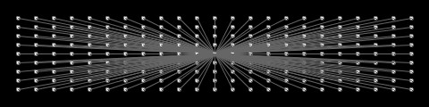

```
size (480, 120);
background (0);
smooth ();
fill (255);
stroke (102);
for (int y = 20; y <= height-20; y += 10)
{
  for (int x = 20; x <= width-20; x += 20) 
  {

    ellipse (x, y, 4, 4);
    //  Dibujamos una linea en el centro de la pantalla

    line(x, y, 240, 60);
  }
}
```

### Ejemplo 11: Círculos.


```
size (480, 120);
background (0);
smooth ();

for (int y = 32; y <= height; y += 8)
 {
 for (int x = 12; x <= width; x += 15)
  {

  ellipse (x + y, y, 16 - y/10.0, 16 - y/10.0);
  }
 }
````

## CAPÍTULO 5
  
### RESPUESTA

El código que responde a la entrada del mouse, el teclado y otros dispositivos de entrada tiene que funcionar continuamente. Para poder empezar, debemos conocer dos métodos fundamentales en Processing.

## Ejemplo 1: La función draw()

Para ver cómo funciona draw(), corremos este ejemplo:

```
void draw()
{
 //muestra los frames en la consola de Processing
 println(“yo estoy dibujando”);
 println(frameCount);
}
```
Saldrá esto:

yo estoy dibujando
1
yo estoy dibujando
2
...

El código dentro de los corchetes del bloque draw() corre desde arriba hasta abajo, y se repite indefinidamente hasta que presionas stop o cierras la ventana. Cada vuelta a través de draw() es llamada por la función frameCount(). (Por defecto la velocidad de cada frame es de 60 frames por segundo, pero esto puede ser cambiado). En el ejemplo anterior, la función println() escribe el texto "estoy dibujando" seguido de un recuento de fotogramas según su contabilidad por la variable especial framecount (recontar) ( 1, 2, 3, 4, 5...). El text aparece en la consola, en el área negra al fondo de la ventana del editor de processing.

## Ejemplo 2: La función setup()

Para complementar la función de loopeo de draw(). Processing tiene una función llamada setup() que corre solo una vez cuando el programa comienza:

```
void setup()
{
println("voy a comenzar");
}

void draw()
{
println("estoy coriendo")
}
```
Cuando este código está corriendo, lo siguiente aparecerá escrito en la consola:

voy a comenzar
estoy corriendo
estoy corriendo
estoy corriendo

El texto "estoy corriendo" continúa escribiéndose en la consla hasta que el programa sea parado.

En un programa típico, el código dentro de setup() es usado para definir los valores del comienzo. La primera línea suele ser la función size(), a menudo seguido por un código para establecer los colores de relleno y el trazo del comienzo, o tal vez para cargar imágenes y fuentes. Si no se incluye la función size, processing por defecto creará una ventana de 100x100 pixeles.

Ahora sabes cómo usar setup() y draw(), pero esta no es toda la historia. Hay una ubicación más para poner código. También puedes poner variables fuera de setup y de draw. Si creas una variable dentro de setup(), o puedes usarla dentro de draw(), así que necesítaras escribir esas variables en otro lugar. Algunas varibales son llamadas globales, porque pueden ser usadas en cualquier parte ("globalmente") en el programa. Esto es más claro cuando tenemos una lista de orden en la cual el código está corriendo:

1. Variables creadas y declaradas fuera de setup() y de draw().
2. El código dentro de setup() corre una vez.
3. El código dentro de dra() corre continuamente.

## Ejemplo 3: setup() y draw()

En el siguiente ejemplo fijaremos los dos metodos juntos:

```
int x = 280;
int y = -100;
int diametro = 380;

void setup()
{
    size(480, 120);
    smooth();
    fill(102);
}
void draw () {
  background (204);
  ellipse (x, y, diametro, diametro);
}
```
## Seguir
Ahora que tenemos el código corriendo continuamente, podemos rastrear la posición del mouse y usar estos números para mover elementos en la pantalla.

## Ejemplo 4: Rastreando el mouse.

La variable mouseX guarda la coordenada x, y la variable mouseY guarda la coordenada y:

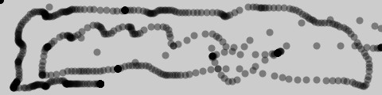

```
void setup()
{
  size(480, 120);
  fill(0, 102);
  smooth();
  noStroke();
}

void draw()
{
  ellipse(mouseX, mouseY, 9, 9);
}
```

En este ejemplo, cada vez que el código en el bloque draw() está corriendo, un nuevo círculo es dibujado en la ventana. Esta imagen fue hecha moviéndose el mouse alrededor de la ventana, para controlar la ubicación del círculo.Porque el relleno es establecido para ser parcialmente transparente, las áreas densas y negras muestran donde el mouse pasa más tiempo y donde se mueve más lento. Loc círculos que son espaciados aparte muestran cuando el mouse se estaba moviendo más rápido.

## Ejemplo 5: Un punto que nos sigue.

En este ejemplo, un nuevo círculo es dibujado en la ventana cada vez que el código dentro de draw() está corriendo. Para refrescar la pantalla y sólo mostrar el círculo más nuevo, coloca la función background() al comienzo de draw() antes de que la forma sea dibujada:


```
void setup()
{
  size(480, 120);
  fill(0, 102);
  smooth();
  noStroke();
}

void draw()
{
  background(204);
  ellipse(mouseX, mouseY, 9, 9);
}
```
La función background() limpia toda la ventana, así que tienes que estar seguro de colocar siempre antes otras funciones dentro de draw(); de otra manera, las formas dibujadas serán borradas.

## Ejemplo 6: Dibujar continuamente.

las variables pmouseX y pmouseY guardan la posición del mouse en el cuadro anterior. Como mouseX y mouseY son variables especiales, son actualizadas cada vez que draw() corre. Combinadas, pueden ser usadas para dibujar líneas continuamente conectando la ubicación actual y la más reciente:

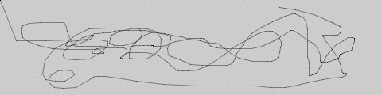

```
void setup()
{
  size(480, 120);
  stroke(4);
  smooth();
  stroke(0, 102);
}

void draw()
{
  line(mouseX, mouseY, pmouseX, pmouseY);
}
```
## Ejemplo 7: Ajustando el grosor sobre la marcha.

Las variables pmouseX y pmouseY pueden también ser usadas para calcular la velocidad del mouse. Esto es hecho midiendo la distancia entre la posición actual y la más reciente del mouse. Si el mouse se mueve lentamente, la distancia es pequeña, pero si el mouse empieza a moverse ráìdamente, la distancia crece. una función llamada dist() simplifica este cálculo, como se muestra en el siguiente ejemplo. Aquí, la velocidad del mouse es usada para establecer el grosor de la línea dibujada:


```
void setup()
{
  size(480, 120);
  smooth();
  stroke(0, 102);
}

void draw()
{
  float ancho = dist(mouseX, mouseY, pmouseX, pmouseY);
  strokeWeight(ancho);
  line(mouseX, mouseY, pmouseX, pmouseY);
}
```
## Ejemplo 8: facilitando las cosas.

En ele ejemplo anterior, los valores del mouse son convertidos directamente en posiciones en la pantalla. Pero a veces quieres que esos valores sigan al mouse libremente, con la finalidad de crear movimientos mas fluidos. Esta técnica es llamda facilitadora (Easing). Para usar esta técnica se tiene en cuenta dos valores: el valor actual y el valor a avanzar. En cada paso del programa, el valor actual se mueve un poco más cerca al valor objetivo:

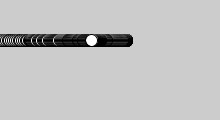

```
float x;
float easing = 0.01;
float diametro = 12;

void setup() 
{
  size(220, 120);
  smooth();
}
void draw() 
{
  float targetX = mouseX;
  x = x + (targetX - x) * easing;
  ellipse(x, 40, diametro, diametro);
  println(targetX + " : " + x);
}
```
El valor de la variable x siempre se acerca al de targetX. La velocidad con la cual se acerca a targetX es establecida con la variable easing, un número entre 0 y 1. Un valor pequeño para facilitar la causa de más de un retardo de un valor mayor. Con un valor facilitador de 1, no hay retardo. Cuando se corre este ejemplo (no olvides descargarlos en este repositorio) los valores actuales son mostrados en la consola a través de la función println(). Cuando se mueve el mouse, notarás como los números están aparte, pero cuando el mouse para de moverse, el valor x se acerca a targetX.

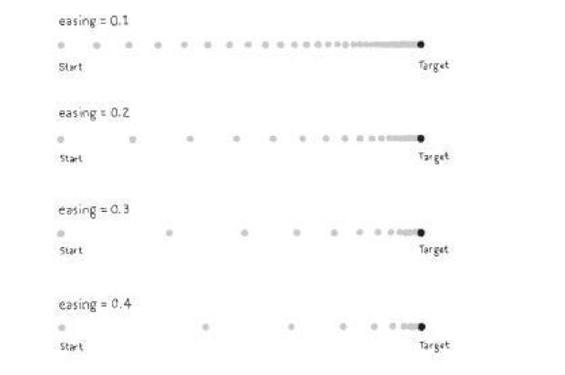

Todo el trabajo en este ejemplo pasa en la línea que comienza en x = x +. Ahí, la diferencia entre el objetivo y el valor actual es calculado, luego es multiplicado por la variable facilitadora y agregada a x para traerlo cerca al objetivo.

## Ejemplo 9: líneas suaves facilitadoras.

En este ejemplo, la técnica facilitadora es aplicada al ejemplo 7, en comparación, las líneas son mas suaves:

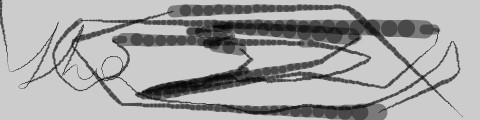

```
float x;
float y;
float posx;
float posy;
float easing = 0.05;

void setup() 
{
  size(480, 120);
  smooth();
  stroke(0, 102);
}

void draw() 
{
  float targetX = mouseX;
  x = x + (targetX - x) * easing;
  
  float targetY = mouseY;
  y = y + (targetY - y) * easing;
  
  float ancho = dist(x, y, posx, posy);
  
  strokeWeight(ancho);
  line(x, y, posx, posy);
  
  posx = x;
  posy = y;
}
```
## La función map()

Cuando los números son usados para dibujar en la pantalla,  es útil convertir los valores de una serie de números a otra.

## Ejemplo 10: Asignando valores a una serie.

la variable mouseX usualmente está entre 0 y el ancho de la ventana, pero tal vez quieras volver a asignar estos valores a una serie diferente de coordenadas. puedes hacer esto haciendo cálculos como dividir mouseX por un número para reducir el ranfo y luego agragar o sustraer un número para desplazarlo a la derecha o a la izquierda:

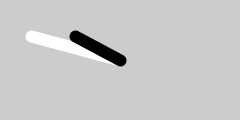

```
void setup() 
{
  size(240, 120);
  strokeWeight(12);
  smooth();
}

void draw() 
{
  background(204);
  stroke(255);
  line(120, 60, mouseX, mouseY); // linea blanca
  stroke(0);
  float mx = mouseX/2 + 60;
  line(120, 60, mx, mouseY);//  linea negra
}
```
La función map() es una forma mas general de hacer este tipo de cambios. Convierte una variable de una serie de números a otra. El primer parámetro es la variable para ser convertida, el segundo y el tercer parametro son los valores altos y bajos de esa variable, y el cuarto y quinto parametro son los valores altos y bajos deseados. la función map() esconde la matemática detras de la conversión.

## Ejemplo 11: Mapeando con la función map()

Este ejemplo reescribe el ejemplo anterior usando map():

```
void setup() 
{
  size(240, 120);
  strokeWeight(12);
  smooth();
}

void draw() 
{
  background(204);
  stroke(255);
  line(120, 60, mouseX, mouseY); // linea blanca
  stroke(0);
  float mx = map(mouseX, 0, width, 60, 180);
  line(120, 60, mx, mouseY);//  linea negra
}
```
La función map() hace que el código sea fácil de leer, porque los valores máximos y mínimos son escritos calaramente como parámetros. En este ejemplo, los valores de mouseX que están entre 0 y el ancho son convertidos a un numero desde 60 (cuando mouseX es 0) hasta 180 (cuando mouseX es width). Encontrarás útil la función map() en varios ejemplos a través de este tutorial.

## click

Además de la ubicación del mouse, Processing también comprueba si el botón del mouse está presionado. la variable mousePressed tiene un valor diferente cuando el botón del mouse es presionado y cuando no. La variable mousePressed es de tipo de datos llamado boolean, lo cual significa que tene sólo dos posibles valores: verdadero o falso. El valor de mousePressed es verdadero cuando el botón es presionado.

## Ejemplo 12: Hacer click con el mouse.

La variable mousePressed es usada junto con la declaración if para deerminar cuándo una línea de código correrá y cuando no. intenta con este ejemplo antes de explicar con más detalle:

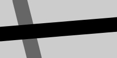

```
void setup() 
{
  size(240, 120);
  smooth();
  strokeWeight(30);
}

void draw() 
{
  background(204);
  stroke(102);
  line(40, 0, 70, height);

  if (mousePressed == true)
  {
    stroke(0);
  }

  line(0, 70, width, 50);
}
```

En este programa, el código dentro del bloque if corre solamente cuando el botón del mouse es presionado. Cuando un botón no es presionado, este código es ignorado. Como se discutio con la "repeticón" del for loop en el capítulo 4, if también tiene un test que es evaluado con verdadero o falso:

```
if (test)
{
statement
}
```
Cuando el test es verdadero, el código dentro del bloque correrá; cuando test es falso, el código dentro del bloque no está corriendo. El computador determinda si el test es verdadero o falso evaluando la expresión dentro del paréntesis.

El símbolo == compara los valores en la izquierda y la derecha del examen si son equivalentes. Este símbolo == es diferente el operador de asignación, el símbolo = sólo. El símbolo == pregunta "son estas dos cosas iguales" y el símbolo = establece el valor de una variable.

--------------------------------
_NOTA:_ Es un error común, incluso para programadores con experiencia, escribir = en el código cuando se quiere escribir ==. El software Processing no siempre te advertirá cuando hagas eso, así que ten cuidado.
--------------------------------
```
if (mousePressed) {}
```
las variables boolean, incluyendo mousePressed, no necesitan la compración explícita con el operador ==, porque sólo pueden ser verdaderas o falsas.

## Ejemplo 13: Detecta cuando no se haga click.


 


